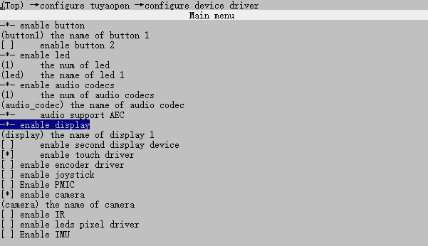
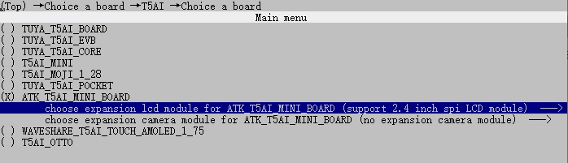

# SPILCD实验

## 前言

本章实验将介绍如何使用TuyaOpen的display组件让T5驱动SPILCD显示屏，实现屏幕刷新。

## Display组件介绍

### 概述

**display**组件实现了显示设备的统一注册、管理、控制和帧缓冲操作，为多种显示屏提供了抽象和统一的管理接口。

1. **显示设备的注册与管理**：支持将不同类型（如8080, SPI, RGB, QSPI, IIC）的显示设备注册到系统中，维护设备列表，便于统一管理和查找。
2. **设备查找与信息获取**：可通过设备名查找已注册的显示设备，并获取设备详细信息（类型、分辨率、像素格式、旋转角度）。
3. **设备生命周期管理**：实现显示设备的打开、关闭等操作，自动处理电源、背光等硬件资源的初始化与释放。
4. **帧缓冲管理**：提供帧缓冲的创建与释放接口，支持 SRAM 、 PSRAM 等不同类型内存的分配。
5. **显示内容刷新**：支持将帧缓存内容刷新到显示设备，实现图像的显示。
6. **背光亮度控制**：根据设备配置，支持通过 GPIO 或 PWM 方式控制背光亮度。
7. **硬件抽象与接口统一**：通过接口结构体，将底层驱动与上层管理解耦，便于扩展和适配不同显示屏硬件。

### Display功能模块

显示组件主要分为两大模块：抽象管理模块和实例化注册模块。

1. **抽象管理模块**（tdl_display）：为应用提供统一的显示屏操作接口；对屏幕驱动芯片进行抽象处理，提供统一的适配接口；为使用几种常规驱动接口（RGB/SPI/QSPI/MCU8080）的屏幕提供更加集成的接口。
2. **实例化注册模块**（tdd_display）：屏幕驱动实例化，目前已经接入了十几种驱动芯片，后续会持续增加；提供将屏幕挂载到抽象管理模块上的注册接口。

这种设计实现了**一次开发，多屏适配**，极大提升了系统的可维护性与硬件扩展性。

### 工作流程


这张图清晰地描绘了一个分层解耦的显示系统架构，它将应用逻辑、通用管理和具体硬件驱动分离开来，使得整个系统灵活、可扩展且易于维护。整个工作流程可以看作一个完整的生命周期，从设备注册到显示，再到关闭。

下面我们简单分析一下TuyaOpen的Display组件实现流程。

**一、 核心角色与职责分工**

在深入流程之前，我们先明确图中四个主要部分的角色定位：

1. **Application (应用层)**
   - **角色：** 系统的“使用者”或“指挥官”。
   - **职责：** 关注业务逻辑，比如“我想在屏幕上显示一张图片”、“我想把屏幕调亮一点”。它不关心屏幕是哪种型号，也不关心如何通过SPI或RGB接口去控制屏幕。它只认识并调用**显示抽象层**提供的统一、简单的接口。
2. **Display Abstract Layer (显示抽象层，简称DAL)**
   - **角色：** 系统的“大管家”或“调度中心”。
   - **职责：** 这是整个架构的核心。它向上为应用层提供标准化的API（如注册、打开、刷新、关闭），向下管理所有具体的显示设备驱动。它维护着一个已注册设备的列表，并根据应用层的请求，找到对应的设备驱动，并将指令“翻译”并派发下去。它实现了硬件细节的完全隔离。
3. **Display Device Driver (显示设备驱动层，简称Driver)**
   - **角色：** 具体设备的“专属技师”。
   - **职责：** 每一种显示屏（如ST7789、ILI9341、SSD1963等）都有一个对应的Driver。这个Driver最懂“自家”屏幕的脾气，知道如何初始化它、如何发送指令、如何写入像素数据。它负责实现与硬件的直接通信（如操作SPI总线、控制GPIO引脚）。
4. **Board (硬件板卡)**
   - **角色：** 物理世界的“执行者”。
   - **职责：** 这是最终的硬件载体，包括显示屏本身、电源管理芯片、背光控制电路（PWM或GPIO）、以及连接它们的通信总线（SPI, QSPI, RGB等）。Driver层的所有操作，最终都会转化为对Board上这些硬件的电信号控制。

**二、 完整工作流程详解**

现在，我们按照一个设备从无到有，再到执行任务，最后被释放的完整生命周期，来串联起整个工作流程。

**阶段一：设备注册与初始化 (让系统“认识”新设备)**

这是所有操作的起点，目的是将一个物理屏幕“接入”到系统中，并使其准备好被使用。

1. **发起注册 (Application → DAL)**
   - **动作：** 应用层决定要使用一块屏幕。它会调用**显示抽象层**提供的“注册显示设备”接口。
   - **传递信息：** 在调用时，应用层需要提供一些基本信息，比如给这个设备起一个唯一的名字（如 “LCD_Main”），以及一些关键的硬件配置参数（如屏幕分辨率、使用的通信接口类型是SPI还是RGB、背光控制引脚号等）。
2. **实例化驱动 (DAL → Driver)**
   - **动作：** **显示抽象层**收到注册请求后，会根据应用层提供的设备类型或配置信息，找到与之匹配的**显示设备驱动**。然后，它会调用该驱动的“目标驱动注册接口”。
   - **传递信息：** DAL会将之前从应用层收到的设备名、初始化命令序列、屏幕类型、驱动接口等详细信息，打包传递给具体的Driver。
3. **硬件初始化 (Driver → Board)**
   - **动作：** **显示设备驱动**接收到指令后，开始执行真正的硬件初始化工作。这就像一个技师在安装和调试一台新设备。
   - **具体操作：**
     - 配置好与屏幕通信的总线（如初始化SPI的时钟、模式）。
     - 控制屏幕的复位引脚，执行一次硬复位。
     - 通过总线向屏幕发送一系列初始化命令（这些命令通常由屏幕厂商提供，用于设置显示方向、色彩格式、像素时钟等）。
     - 初始化背光控制电路（如配置PWM的频率和占空比）。
4. **注册完成 (Driver → DAL → Application)**
   - **动作：** 硬件初始化完成后，**显示设备驱动**会向**显示抽象层**返回一个结果（成功或失败）。
   - **后续处理：**
     - 如果成功，DAL会在自己内部维护的“设备管理列表”中，为这个新设备创建一个条目，记录下它的名字、状态和对应的驱动指针等信息。此时，设备才算真正“注册”到系统中。
     - 最后，DAL将最终的注册结果返回给**应用层**。应用层从此就可以通过设备名来操作这块屏幕了。

**阶段二：设备控制与操作 (让屏幕“动起来”)**

设备注册成功后，应用层就可以对它进行各种操作了。我们以最常见的“显示内容刷新”为例。

1. **发起操作 (Application → DAL)**
   - **动作：** 应用层已经准备好了一帧图像数据（比如在一个内存缓冲区里），现在想把它显示到屏幕上。它会调用**显示抽象层**的“显示内容刷新”接口。
   - **传递信息：** 调用时，应用层需要告诉DAL要操作哪个设备（通过设备名或之前打开设备时返回的句柄），以及图像数据存放在哪里（帧缓冲区的地址）。
2. **指令派发 (DAL → Driver)**
   - **动作：** **显示抽象层**根据设备名或句柄，在自己的设备列表中找到对应的设备条目，从而定位到具体的**显示设备驱动**。然后，它会调用该驱动的“刷新显示驱动”接口。
   - **传递信息：** DAL会将帧缓冲区的地址、需要刷新的区域（如全屏或部分窗口）等信息传递给Driver。
3. **数据传输 (Driver → Board)**
   - **动作：** **显示设备驱动**开始执行数据传输。这是最核心的显示过程。
   - **具体操作：**
     - 首先，通过总线向屏幕发送设置显示窗口的命令，告诉屏幕接下来要更新哪块区域。
     - 然后，发送写入像素数据的命令。
     - 最后，将帧缓冲区中的图像数据，通过SPI、MCU8080等总线，将像素“推”给屏幕。
4. **屏幕显示 (Board)**
   - **动作：** 屏幕控制器接收到所有像素数据后，会自动驱动液晶面板或OLED阵列，将数据显示出来。至此，用户就看到了应用层想要展示的画面。

**阶段三：设备关闭与资源释放 (让设备“安全退休”)**

当应用不再需要使用屏幕，或者系统要关机时，需要正确地关闭设备，释放资源。

1. **发起关闭 (Application → DAL)**
   - **动作：** 应用层调用**显示抽象层**的“关闭设备”接口。
2. **执行去初始化 (DAL → Driver → Board)**
   - **动作：**DAL找到对应的Driver，并调用其“关闭设备驱动”接口。Driver随后执行与初始化相反的操作：
     - 关闭背光（将PWM占空比设为0或直接关闭GPIO）。
     - 向屏幕发送进入睡眠模式的指令。
     - 关闭屏幕的电源（如果受控）。
     - 释放之前占用的总线等硬件资源。
3. **注销设备 (DAL)**
   - **动作：** Driver操作完成后，DAL会从自己的设备管理列表中移除该设备的条目。至此，设备与系统的连接被完全切断。

## **论如何与一块“高冷”的显示屏化敌为友**

嘿，朋友！是不是感觉你和你的显示屏之间，隔着一道马里亚纳海沟？您用TuyaOpen的Display组件，代码写得风生水起，信心满满地一上电，结果屏幕……它就静静地躺在那里，对你爱答不理，仿佛在说：“呵，就你？还想点亮我？”。别灰心，你不是一个人在战斗！几乎每个嵌入式开发者，都曾有过被一块“高冷”屏幕无情支配的恐惧。今天，我们就来聊聊，如何用TuyaOpen Display组件，成功“破冰”，让你的屏幕对你“亮”起绿灯。

### **第一步：别急着写代码，先去“查户口”**

想象一下，你要追一个女孩，总得先知道她叫什么、喜欢什么、讨厌什么吧？适配屏幕也是同理！在您敲下屏幕驱动之前，请务必先完成对这块屏幕的“背景调查”。

- **它叫什么型号？** (e.g., ST7789, ILI9341, GC9A01) —— 这是最基本的礼貌，连名字都叫错，后面就别聊了。
- **它怎么“听话”？** (e.g., SPI, 8080, RGB) —— 它是说SPI这种“悄悄话”的，还是需要8080这种“大喇叭”喊话的？通信方式错了，你在它耳边说一万遍“我爱你”，它也只会给你一个“黑脸”。
- 它的“脾气”如何？—— 这是最关键的！你需要找到它的**《数据手册》**，这本“性格说明书”会告诉你：
  - **初始化“暗号”**：它需要你先发一串特定的命令（比如`0x11`表示睡眠退出，`0x29`表示显示开启），才能被“唤醒”。这些暗号错一个，它就继续装睡。
  - **分辨率**：它到底有多大“脸面”？240x240还是320x480？你往一个240x240的脸上硬塞一张320x480的“大饼”，它当然不乐意，只会给你显示“四不像”。
  - **RGB顺序**：它喜欢“红绿蓝”还是“蓝绿红”？你给它一杯“BGR”的鸡尾酒，它却以为是一杯“RGB”的毒药，颜色自然乱七八糟。
  - **“背光”怎么控制？** 它的“眼睛”（背光）是用GPIO直接开关，还是需要PWM来调亮度？眼睛都不睁开，你当然看不到它“亮”起来。

使用display组件，需要打开显示驱动的使能宏，操作如下：

```
tos.py config menu
```

然后到configure device driver中使能display。



还需要选择对应的屏幕类型，2.4寸SPI接口LCD。



记得最后要保存。

方便快捷直接使用 `tos.py config choice`命令选择生成好的配置文件。

这里，笔者使用正点原子的ATK-MD0240为例--参考文档ATK-MD0240模块SPI接口用户手册.pdf。

**1，ATK-MD0240基本参数**

| 项目        | 说明                                                   |
| ----------- | ------------------------------------------------------ |
| 通信接口    | 四线SPI/三线SPI/Inter 8080-16位并口/Inter 8080-8位并口 |
| 颜色格式    | RGB565                                                 |
| 颜色深度    | 16位                                                   |
| LCD驱动芯片 | ST7789                                                 |
| LCD分辨率   | 240*320                                                |
| 屏幕尺寸    | 2.4‘                                                   |

**2，ATK-MD0240原理图**


从上图可以看出，我们根据M0、M1和M2来选择通信接口，默认情况下ATK-MD0240显示屏选择的是4线的SPI通信接口。若用户想使用8080-8位并口通信接口，可修改M0、M1和M2的高低电平实现。下面笔者使用四线SPI来驱动这一块SPILCD显示屏。

**3，四线SPI管脚连接**

| 序号 | 名称    | 描述                                                  |
| ---- | ------- | ----------------------------------------------------- |
| 1    | VCC3.3  | 3.3电源供电                                           |
| 2    | LCD_CS  | SPI通讯片选信号（低电平有效）                         |
| 3    | LCD_SDA | SPI通讯MOSI信号线                                     |
| 4    | LCD_RST | 硬件复位引脚（低电平有效）                            |
| 5    | LCD_DC  | 写命令/数据信号线（低电平：写命令；高电平：写数据）   |
| 6    | LCD_SCK | SPI通信SCK信号线                                      |
| 7    | LCD_PWR | LCD背光控制引脚（低电平：关闭背光；高电平：开启背光） |
| 8    | GND     | 电源地                                                |

至此，我们已经知道ATK-MD0240显示屏的庐山真面目，下面我们重点介绍如何使用TuyaOpen的Display组件驱动该屏幕。

### **第二步：当个“翻译官”，而不是“复读机”**

TuyaOpen的Display组件是个“大管家”，它只说“普通话”（统一的API），比如“打开设备”、“刷新画面”。但你的屏幕可能只说“方言”（它自己独特的命令集）。这时候，你就需要扮演一个**翻译官**的角色，也就是**编写驱动**。

在TuyaOpen显示组件中，`tdd_display`模块是您的驱动库”。根据您的屏幕型号，适配路径分为两种：

- **路径一：完美匹配 (即插即用)**
  - **条件**：您的屏幕型号已存在于`tdd_display`的已适配列表中。
  - **操作**：直接调用对应的驱动实例化函数，完成注册即可。无需关心底层细节。
  - **驱动路径**：TuyaOpen/src/peripherals/display/tdd_display路径下包含TuyaOpen适配的显示屏


正点原子ATK-MD0240显示屏驱动IC是ST7789，目前使用SPI接口，刚好你就发现上图中就有tdd_disp_spi_st7789.c，这证明直接有接口可以调用。

正点原子ATK-MD0240显示屏代码分为两部分，一部分在“TuyaOpen\boards\T5AI\ATK_T5AI_MINI_BOARD\board_ex_module.c”，用于底层硬件初始化；另一部分在“components\BSP\TFTLCD”，用于上层初始化以及功能函数展示。

下面看一下正点原子ATK-MD0240显示屏底层初始化代码。

```c    
//函数所处路径“boards\T5AI\ATK_T5AI_MINI_BOARD\board_ex_module.c”
static OPERATE_RET __board_register_display(void)
{
    OPERATE_RET rt = OPRT_OK;
    DISP_SPI_DEVICE_CFG_T display_cfg;

    memset(&display_cfg, 0, sizeof(DISP_SPI_DEVICE_CFG_T));

    /* Configure the SPI0 pins */
    tkl_io_pinmux_config(BOARD_LCD_SPI_CS_PIN, TUYA_SPI0_CS);
    tkl_io_pinmux_config(BOARD_LCD_SPI_SCL_PIN, TUYA_SPI0_CLK);
    tkl_io_pinmux_config(BOARD_LCD_SPI_SDA_PIN, TUYA_SPI0_MOSI);
    tkl_io_pinmux_config(BOARD_LCD_SPI_SDI_PIN, TUYA_SPI0_MISO);

    display_cfg.width     = BOARD_LCD_WIDTH;
    display_cfg.height    = BOARD_LCD_HEIGHT;
    display_cfg.pixel_fmt = BOARD_LCD_PIXELS_FMT;
    display_cfg.rotation  = BOARD_LCD_ROTATION;

    display_cfg.port      = BOARD_LCD_SPI_PORT;
    display_cfg.spi_clk   = BOARD_LCD_SPI_CLK;
    display_cfg.cs_pin    = BOARD_LCD_SPI_CS_PIN;
    display_cfg.dc_pin    = BOARD_LCD_SPI_DC_PIN;
    display_cfg.rst_pin   = BOARD_LCD_SPI_RST_PIN;

    display_cfg.bl.type              = BOARD_LCD_BL_TYPE;
    display_cfg.bl.gpio.pin          = BOARD_LCD_BL_PIN;
    display_cfg.bl.gpio.active_level = BOARD_LCD_BL_ACTIVE_LV;

    display_cfg.power.pin = BOARD_LCD_POWER_PIN;

    TUYA_CALL_ERR_RETURN(tdd_disp_spi_st7789_register(DISPLAY_NAME, &display_cfg)); 

    return rt;
}
```

函数中涉及到的宏定义在对应的头文件中，如下所示。

```c
//引脚相关宏定义所处路径“boards\T5AI\ATK_T5AI_MINI_BOARD\board_ex_module.h”
#define BOARD_LCD_WIDTH              240
#define BOARD_LCD_HEIGHT             320
#define BOARD_LCD_PIXELS_FMT         TUYA_PIXEL_FMT_RGB565
#define BOARD_LCD_ROTATION           TUYA_DISPLAY_ROTATION_0

#define BOARD_LCD_SPI_PORT           TUYA_SPI_NUM_0
#define BOARD_LCD_SPI_CLK            48000000
#define BOARD_LCD_SPI_DC_PIN         TUYA_GPIO_NUM_42
#define BOARD_LCD_SPI_RST_PIN        TUYA_GPIO_NUM_43
#define BOARD_LCD_SPI_CS_PIN         TUYA_GPIO_NUM_45
#define BOARD_LCD_SPI_SCL_PIN        TUYA_GPIO_NUM_44
#define BOARD_LCD_SPI_SDA_PIN        TUYA_GPIO_NUM_46
#define BOARD_LCD_SPI_SDI_PIN        TUYA_GPIO_NUM_47

#define BOARD_LCD_BL_TYPE            TUYA_DISP_BL_TP_GPIO 
#define BOARD_LCD_BL_PIN             TUYA_GPIO_NUM_9
#define BOARD_LCD_BL_ACTIVE_LV       TUYA_GPIO_LEVEL_HIGH

#define BOARD_LCD_POWER_PIN          TUYA_GPIO_NUM_MAX
```

下面看一下正点原子ATK-MD0240显示屏上层初始化代码。

```c
#include "tuya_cloud_types.h"
#include "tal_api.h"
#include "tdd_disp_type.h"
#include "tdl_display_driver.h"
#include "tkl_gpio.h"
#include "board_com_api.h"

TDL_DISP_HANDLE_T sg_tdl_disp_hdl = NULL;
TDL_DISP_FRAME_BUFF_T *sg_p_display_fb = NULL;
TDL_DISP_DEV_INFO_T sg_display_info;

_tftlcd_dev tftdev;     /* TFT LCD device structure */


/**
 * @brief Registers an TFT display device with the specified configuration.
 *
 * This function initializes the TFT display device with the provided configuration,
 * registers it, and prepares it for use by setting up the display handle and frame buffer.
 *
 * @return Returns OPRT_OK on success, or an appropriate error code if registration fails.
 */
OPERATE_RET tdd_disp_atk_tftlcd_register(void)
{
    OPERATE_RET rt = OPRT_OK;
    uint32_t frame_len = 0;

    /*****************************一：注册显示屏设备*****************************/
    /* hardware register */
    board_register_hardware();

    memset(&sg_display_info, 0, sizeof(TDL_DISP_DEV_INFO_T));

    /*****************************二：获取设备控制句柄*****************************/
    sg_tdl_disp_hdl = tdl_disp_find_dev(DISPLAY_NAME);                          /* Find the display device by name */

    if(NULL == sg_tdl_disp_hdl) 
    {
        PR_ERR("display dev %s not found", DISPLAY_NAME);
        return OPRT_NOT_FOUND;
    }

    rt = tdl_disp_dev_get_info(sg_tdl_disp_hdl, &sg_display_info);              /* Get display device information */
    if(rt != OPRT_OK) 
    {
        PR_ERR("get display dev info failed, rt: %d", rt);
        return OPRT_NOT_FOUND;
    }

    tftdev.width = sg_display_info.width;
    tftdev.height = sg_display_info.height;

    /*****************************三：打开设备*****************************/
    rt = tdl_disp_dev_open(sg_tdl_disp_hdl);                                    /* Open the display device */
    if(rt != OPRT_OK) 
    {
        PR_ERR("open display dev failed, rt: %d", rt);
        return OPRT_NOT_FOUND;
    }
    tdl_disp_set_brightness(sg_tdl_disp_hdl, 100);                              /* Set brightness to 100% */

    /*****************************四：创建Frame Buffer*****************************/
    frame_len = sg_display_info.width * sg_display_info.height * 2;             /* Calculate frame buffer length based on width, height, and pixel format */
    PR_DEBUG("frame_len: %d; width: %d; height: %d;", frame_len, sg_display_info.width, sg_display_info.height);
    sg_p_display_fb = tdl_disp_create_frame_buff(DISP_FB_TP_PSRAM, frame_len);  /* Create a frame buffer in PSRAM */

    if(NULL == sg_p_display_fb) 
    {
        PR_ERR("create display frame buff failed");
        return OPRT_MALLOC_FAILED;
    }
    
    sg_p_display_fb->fmt    = sg_display_info.fmt;
    sg_p_display_fb->width  = sg_display_info.width;
    sg_p_display_fb->height = sg_display_info.height;
    tftdev.display_fb = sg_p_display_fb;    /* Set the display frame buffer pointer */
    tftdev.disp_hdl = sg_tdl_disp_hdl;      /* Set the display handle */

    /*****************************五：刷新显示*****************************/
    tftlcd_clear(WHITE);                    /* Clear the display to white */

    return rt;
}

/**
 * @brief Clears the TFT LCD display by filling it with a specified color.
 *
 * @param color Color to fill the display with in RGB565 format.
 */
void tftlcd_clear(uint16_t color)
{
    if (!sg_p_display_fb) return;
    uint16_t *fb = (uint16_t *)sg_p_display_fb->frame;
    uint32_t total = sg_p_display_fb->width * sg_p_display_fb->height;

    for (uint32_t i = 0; i < total; i++) 
    {
        fb[i] = swap16_u16(color);
    }
    tdl_disp_dev_flush(sg_tdl_disp_hdl, sg_p_display_fb);
}

/**
 * @brief Color byte order conversion function
 * @note  RGB LCD does not require byte order conversion, SPI LCD requires byte order conversion
 */
static inline uint16_t swap16_u16(uint16_t v)
{
#if defined(ATK_T5AI_MINI_BOARD_LCD_MD0700R_RGB)
    /* RGB LCD: no byte order conversion needed */
    return v; 
#else
    /* SPI LCD: byte order conversion needed */
    return (uint16_t)((v >> 8) | (v << 8));
#endif
}
```

**驱动一款屏幕之所以简单，正是因为我们严格遵循了TuyaOpen的Display组件的标准化工作流程。** 从注册到刷新，每一步都由框架精心引导。开发者无需关心底层细节，只需扮演好配置者”的角色，将现成的驱动模块对号入座”，即可轻松点亮屏幕。这，就是优秀架构的魅力——将复杂留给自己，将简单带给用户。

- **路径二：差异适配 (二次开发)**
  - **条件**：您的屏幕与已适配型号存在差异（如分辨率、初始化序列、特殊指令等）。
  - **操作**：以最接近的已适配驱动为模板”，通过调用`tdd_display`提供的底层硬件接口（如SPI、RGB...），自行修改或补充差异部分，实现快速定制。

如果以上代码驱动出来的屏幕效果，颜色不对，花屏，可以进行差异配置初始化。

```C
#include "tuya_cloud_types.h"
#include "tal_api.h"
#include "tdd_disp_type.h"
#include "tdl_display_driver.h"
#include "tkl_gpio.h"
#include "board_com_api.h"

#define SPILCD_DISPLAY_NAME "spilcd"  				/* 自定义设备名称 */

TDL_DISP_HANDLE_T sg_tdl_disp_hdl = NULL;
TDL_DISP_FRAME_BUFF_T *sg_p_display_fb = NULL;
TDL_DISP_DEV_INFO_T sg_display_info;

_tftlcd_dev tftdev;     /* TFT LCD device structure */

/* 初始化资料 */
const uint8_t atk_cST7789_INIT_SEQ[] = {
    1,    100,  ST7789_SWRESET,
    /* 请自己问屏幕厂家要初始化序列 */
    1,    10,   ST7789_DISPON,
    0
};

static TDD_DISP_SPI_CFG_T atk_sg_disp_spi_cfg = {
    .cfg =
        {   /* 操作命令 */
            .cmd_caset = ST7789_CASET,
            .cmd_raset = ST7789_RASET,
            .cmd_ramwr = ST7789_RAMWR,
        },
         
    .is_swap = true,        /* 是否需要交换RGB */
    .init_seq = atk_cST7789_INIT_SEQ,
    .set_window_cb = NULL,  /* 设置窗口回调函数 */
};

/* 自定义SPILCD初始化 */
OPERATE_RET atk_disp_spi_st7789_register(char *name, DISP_SPI_DEVICE_CFG_T *dev_cfg)
{
    if (NULL == name || NULL == dev_cfg) {
        return OPRT_INVALID_PARM;
    }

    PR_NOTICE("tdd_disp_spi_st7789_register: %s", name);

    atk_sg_disp_spi_cfg.cfg.width = dev_cfg->width;
    atk_sg_disp_spi_cfg.cfg.height = dev_cfg->height;
    atk_sg_disp_spi_cfg.cfg.pixel_fmt = dev_cfg->pixel_fmt;
    atk_sg_disp_spi_cfg.cfg.port = dev_cfg->port;
    atk_sg_disp_spi_cfg.cfg.spi_clk = dev_cfg->spi_clk;
    atk_sg_disp_spi_cfg.cfg.cs_pin = dev_cfg->cs_pin;
    atk_sg_disp_spi_cfg.cfg.dc_pin = dev_cfg->dc_pin;
    atk_sg_disp_spi_cfg.cfg.rst_pin = dev_cfg->rst_pin;
    atk_sg_disp_spi_cfg.rotation = dev_cfg->rotation;

    memcpy(&atk_sg_disp_spi_cfg.power, &dev_cfg->power, sizeof(TUYA_DISPLAY_IO_CTRL_T));
    memcpy(&atk_sg_disp_spi_cfg.bl, &dev_cfg->bl, sizeof(TUYA_DISPLAY_BL_CTRL_T));

    return tdd_disp_spi_device_register(name, &atk_sg_disp_spi_cfg);
}

/**
 * @brief Registers an TFT display device with the specified configuration.
 *
 * This function initializes the TFT display device with the provided configuration,
 * registers it, and prepares it for use by setting up the display handle and frame buffer.
 *
 * @return Returns OPRT_OK on success, or an appropriate error code if registration fails.
 */
OPERATE_RET tdd_disp_atk_tftlcd_register(void)
{
    OPERATE_RET rt = OPRT_OK;
    uint32_t frame_len = 0;

    /*****************************一：注册显示屏设备*****************************/
    /* hardware register */
    /*****************************一：注册显示屏设备*****************************/

    memset(&display_cfg, 0, sizeof(DISP_RGB_DEVICE_CFG_T));
    /* 复用管脚--根据芯片手册找到SPI相关管脚 */
    tkl_io_pinmux_config(TUYA_GPIO_NUM_44, TUYA_SPI0_CLK);
    tkl_io_pinmux_config(TUYA_GPIO_NUM_45, TUYA_SPI0_CS);
    tkl_io_pinmux_config(TUYA_GPIO_NUM_46, TUYA_SPI0_MOSI);
    tkl_io_pinmux_config(TUYA_GPIO_NUM_47, TUYA_SPI0_MISO);
	/* 配置背光管脚 */
    display_cfg.bl.type              = TUYA_DISP_BL_TP_GPIO;	/* GPIO\PWM控制 */
    display_cfg.bl.gpio.pin          = TUYA_GPIO_NUM_9;			/* 背光管脚 */
    display_cfg.bl.gpio.active_level = TUYA_GPIO_LEVEL_HIGH;	/* 高电平有效 */
	/* 屏幕分辨率 */
    display_cfg.width     = 240;
    display_cfg.height    = 320;
    /* 颜色格式和旋转配置 */
    display_cfg.pixel_fmt = TUYA_PIXEL_FMT_RGB565;
    display_cfg.rotation  = TUYA_DISPLAY_ROTATION_0;

    display_cfg.port      = TUYA_SPI_NUM_0;		/* SPI端口号 */
    display_cfg.spi_clk   = 48000000;			/* 频率 */
    display_cfg.cs_pin    = TUYA_GPIO_NUM_45;	/* 片选 */
    display_cfg.dc_pin    = TUYA_GPIO_NUM_7;	/* 命令/数据 */
    display_cfg.rst_pin   = TUYA_GPIO_NUM_6;	/* 复位 */

    display_cfg.power.pin          = TUYA_GPIO_NUM_MAX;		/* 控制屏幕电源管脚 */
    display_cfg.power.active_level = TUYA_GPIO_LEVEL_HIGH;	/* 触发电平 */

    rt = atk_disp_spi_st7789_register(SPILCD_DISPLAY_NAME, &display_cfg);	/* 调用自定义SPILCD初始化 */

    if (rt != OPRT_OK) {
        PR_ERR("SPI LCD display initialization failed: %d", rt);
        return OPRT_NOT_FOUND;
    }

    memset(&sg_display_info, 0, sizeof(TDL_DISP_DEV_INFO_T));

    /*****************************二：获取设备控制句柄*****************************/
    sg_tdl_disp_hdl = tdl_disp_find_dev(DISPLAY_NAME);                          /* Find the display device by name */

    if(NULL == sg_tdl_disp_hdl) 
    {
        PR_ERR("display dev %s not found", DISPLAY_NAME);
        return OPRT_NOT_FOUND;
    }

    rt = tdl_disp_dev_get_info(sg_tdl_disp_hdl, &sg_display_info);              /* Get display device information */
    if(rt != OPRT_OK) 
    {
        PR_ERR("get display dev info failed, rt: %d", rt);
        return OPRT_NOT_FOUND;
    }

    tftdev.width = sg_display_info.width;
    tftdev.height = sg_display_info.height;

    /*****************************三：打开设备*****************************/
    rt = tdl_disp_dev_open(sg_tdl_disp_hdl);                                    /* Open the display device */
    if(rt != OPRT_OK) 
    {
        PR_ERR("open display dev failed, rt: %d", rt);
        return OPRT_NOT_FOUND;
    }
    tdl_disp_set_brightness(sg_tdl_disp_hdl, 100);                              /* Set brightness to 100% */

    /*****************************四：创建Frame Buffer*****************************/
    frame_len = sg_display_info.width * sg_display_info.height * 2;             /* Calculate frame buffer length based on width, height, and pixel format */
    PR_DEBUG("frame_len: %d; width: %d; height: %d;", frame_len, sg_display_info.width, sg_display_info.height);
    sg_p_display_fb = tdl_disp_create_frame_buff(DISP_FB_TP_PSRAM, frame_len);  /* Create a frame buffer in PSRAM */

    if(NULL == sg_p_display_fb) 
    {
        PR_ERR("create display frame buff failed");
        return OPRT_MALLOC_FAILED;
    }
    
    sg_p_display_fb->fmt    = sg_display_info.fmt;
    sg_p_display_fb->width  = sg_display_info.width;
    sg_p_display_fb->height = sg_display_info.height;
    tftdev.display_fb = sg_p_display_fb;    /* Set the display frame buffer pointer */
    tftdev.disp_hdl = sg_tdl_disp_hdl;      /* Set the display handle */

    /*****************************五：刷新显示*****************************/
    tftlcd_clear(WHITE);                    /* Clear the display to white */

    return rt;
}
```

从上述代码可以看出，若官方提供的ST7789驱动初始化序列与您的屏幕硬件不匹配（如寄存器配置不同或缺少特定指令），您无需修改底层驱动。只需覆盖默认的初始化配置数组，传入您自己定义的序列即可。这为硬件差异提供了极大的灵活性和适配空间。

**我们通过以上的代码分离设计，可以使得TFTLCD可以兼容多种屏幕。**

### **第三步：检查“信号线”，别让信号“迷路”**

您说了正确的“方言”，但信号没送到，那也是白搭。这就像你电话拨对了，但电话线是断的。

- **SPI配置对了吗？** 时钟频率、CPOL、CPHA这三个“铁三角”是不是和屏幕要求的一致？一个不对，数据就全乱了。
- **引脚接对了吗？** CS（片选）、DC（数据/命令选择）、RST（复位）、BLK（背光）这些“生命线”是不是都接到了正确的GPIO上？特别是DC线，它决定了你发过去的是“命令”还是“数据”，接反了，屏幕会把你的“唤醒暗号”当成“显示数据”，然后一脸懵逼。
- **电源够力吗？** 屏幕是不是“吃饱饭”了？电压够不够？电流够不够？有些屏幕瞬间电流很大，电源不给力，它直接“宕机”，你当然点不亮。

**终极奥义：逻辑分析仪/示波器，你的“第三只眼”**

如果以上三步都做了，屏幕还是“黑着脸”，别急着怀疑人生。是时候请出您的“秘密武器”——**逻辑分析仪**或**示波器**了。

把它接在SPI总线上，跑一遍初始化代码。你就能亲眼看到：

- 您发的“暗号”是不是真的发出去了？
- 顺序对不对？数据对不对？
- 时序有没有问题？

这就像您和屏幕之间有了个“同声传译”，它能告诉你到底是你“说错了”，还是屏幕“听错了”。99%的点不亮问题，在这里都能找到答案。

以上是正点原子ATK-MD0240显示屏SPI驱动方式。

## API 描述

**1，tdd_disp_spi_st7789_register函数**

​	通过SPI接口注册ST7789 TFT显示设备到显示管理系统。

```C
OPERATE_RET tdd_disp_spi_st7789_register(char *name, DISP_SPI_DEVICE_CFG_T *dev_cfg);
```

​	**1.1 参数描述**

|  形参   |             描述             |
| :-----: | :--------------------------: |
|  name   |         屏幕设备名称         |
| dev_cfg | 指向spi接口设备配置结构的指针 |

​	`name`：屏幕设备名称：

​	`dev_cfg`：屏幕配置结构。

```C
/* TuyaOpen/src/peripherals/display/tdd_display/include/tdd_disp_type.h */
typedef struct {
    uint16_t width;
    uint16_t height;
    TUYA_DISPLAY_PIXEL_FMT_E pixel_fmt;
    TUYA_DISPLAY_ROTATION_E rotation;
    TUYA_GPIO_NUM_E cs_pin;
    TUYA_GPIO_NUM_E dc_pin;
    TUYA_GPIO_NUM_E rst_pin;
    TUYA_SPI_NUM_E port;
    uint32_t spi_clk;
    TUYA_DISPLAY_BL_CTRL_T bl;
    TUYA_DISPLAY_IO_CTRL_T power;
} DISP_SPI_DEVICE_CFG_T;
```

​	**1.2 返回值**

​	OPRT_OK表示成功。关于其他错误，请参考`tuya_error_code.h`。

**2，tdl_disp_find_dev函数**

​	根据设备名称查找设备控制句柄。

```C
TDL_DISP_HANDLE_T tdl_disp_find_dev(char *name);
```

​	**2.1 参数描述**

​	`name`：屏幕设备名称

​	**2.2 返回值**

​	返回显示设备的句柄，如果没有找到匹配的设备则返回NULL。

**3，tdl_disp_dev_get_info函数**

​	获取显示设备的信息。

```C
OPERATE_RET tdl_disp_dev_get_info(TDL_DISP_HANDLE_T disp_hdl, TDL_DISP_DEV_INFO_T *dev_info);
```

​	**3.1 参数描述**

​	`disp_hdl`：屏幕设备句柄

​	`dev_info`：设备信息指针

```C
/* TuyaOpen/src/peripherals/display/tdl_display/include/tdl_display_manage.h */
typedef struct {
    TUYA_DISPLAY_TYPE_E type;			/* 屏幕类型SPI、MCU8080、RGBLCD.... */
    TUYA_DISPLAY_ROTATION_E rotation;	/* 屏幕旋转方向 */
    uint16_t width;						/* 宽度 */
    uint16_t height;					/* 高度 */
    TUYA_DISPLAY_PIXEL_FMT_E fmt;		/* 颜色格式 */
    bool                     is_swap;	/* 颜色交换 */
} TDL_DISP_DEV_INFO_T;
```

​	**3.2 返回值：**

​	OPRT_OK表示成功。关于其他错误，请参考`tuya_error_code.h`。

**4，tdl_disp_dev_open函数**

​	打开显示设备。

```C
OPERATE_RET tdl_disp_dev_open(TDL_DISP_HANDLE_T disp_hdl);
```

​	**4.1 参数描述**

​	`disp_hdl`：屏幕设备句柄

​	**4.2 返回值：**

​	OPRT_OK表示成功。关于其他错误，请参考`tuya_error_code.h`。

**5，tdl_disp_set_brightness函数**

​	设置背光亮度（设置背光亮度百分比（0% - 100%））。

```C
OPERATE_RET tdl_disp_set_brightness(TDL_DISP_HANDLE_T disp_hdl, uint8_t brightness);
```

​	**5.1 参数描述**

​	`disp_hdl`：屏幕设备句柄

​	`brightness`：背光百分比

​	**5.2 返回值：**

​	OPRT_OK表示成功。关于其他错误，请参考`tuya_error_code.h`。

**6，tdl_disp_create_frame_buff函数**

​	创建帧缓存。

```C
TDL_DISP_FRAME_BUFF_T *tdl_disp_create_frame_buff(DISP_FB_RAM_TP_E type, uint32_t len);
```

​	**6.1 参数描述**

​	`type`：申请帧缓存内存类型

​	`len`：申请帧缓存大小

​	**6.2 返回值：**

​	返回TDL_DISP_FRAME_BUFF_T显示缓存指针。

## 硬件设计

### 例程功能

1，驱动SPILCD屏幕实现一秒周期内切换颜色刷新屏幕。

### 硬件资源

1，SPILCD

​	DC/WR: P42

​	RST: P43

​	CS: P45

​	SCK: P44

​	SDA: P46

​	BL/PWR: P9

### 原理图

正点原子T5 AI开发板与2.4寸SPILCD屏幕使用杜邦线进行连接。

## 程序设计

### 1，TFTLCD驱动代码

这里我们只讲解核心代码，详细的源码请大家参考光盘资料本实验对应的源码。TFTLCD驱动源码包括两个文件：tftlcd.c和tftlcd.h

tftlcd.h文件是对TFTLCD引脚做了相关定义以及函数声明。

```C
/******************************************************************
 * @brief       TFT LCD backlight control pin
 ******************************************************************/
#define LCD_BL_PIN          (TUYA_GPIO_NUM_15)


/******************************************************************
 * @brief       TFT LCD device structure
 ******************************************************************/
typedef struct  
{
    uint16_t id;                        /* Panel ID */
    uint16_t width;                     /* Display width in pixels */
    uint16_t height;                    /* Display height in pixels */
    TDL_DISP_FRAME_BUFF_T *display_fb;  /* Frame buffer pointer */
    TDL_DISP_HANDLE_T disp_hdl;         /* Display handle */
} _tftlcd_dev; 

/******************************************************************
 * @brief       TFT LCD color definitions
 ******************************************************************/
#define WHITE           0xFFFF
#define BLACK           0x0000
#define RED             0xF800
#define GREEN           0x07E0
#define BLUE            0x001F
#define MAGENTA         0XF81F
#define YELLOW          0XFFE0
#define CYAN            0X07FF
#define BROWN           0XBC40
#define BRRED           0XFC07
#define GRAY            0X8430
#define DARKBLUE        0X01CF
#define LIGHTBLUE       0X7D7C
#define GRAYBLUE        0X5458
#define LIGHTGREEN      0X841F
#define LGRAY           0XC618
#define LGRAYBLUE       0XA651
#define LBBLUE          0X2B12

/******************************************************************
 * @brief       TFT LCD display device handle
 ******************************************************************/
extern _tftlcd_dev tftdev;

/* Function Declaration */
OPERATE_RET tdd_disp_atk_tftlcd_register(void);
void tftlcd_draw_point(uint16_t x, uint16_t y, uint16_t color);
void tftlcd_draw_line(uint16_t x1, uint16_t y1, uint16_t x2, uint16_t y2, uint16_t color);
void tftlcd_draw_rectangle(uint16_t x0, uint16_t y0, uint16_t x1, uint16_t y1,uint16_t color);
void tftlcd_draw_hline(uint16_t x, uint16_t y, uint16_t len, uint16_t color);
void tftlcd_fill_rect(uint16_t x, uint16_t y, uint16_t w, uint16_t h, uint16_t color);
void tftlcd_draw_circle(uint16_t x0, uint16_t y0, uint16_t r, uint16_t color);
void tftlcd_clear(uint16_t color);
void tftlcd_fill_circle(uint16_t center_x, uint16_t center_y, uint16_t radius, uint16_t color);
void tftlcd_show_char(uint16_t x, uint16_t y, char chr, uint8_t size, uint8_t mode, uint16_t color);
void tftlcd_show_num(uint16_t x, uint16_t y, uint32_t num, uint8_t len, uint8_t size, uint16_t color);
void tftlcd_show_xnum(uint16_t x, uint16_t y, uint32_t num, uint8_t len, uint8_t size, uint8_t mode, uint16_t color);
void tftlcd_show_string(uint16_t x, uint16_t y, uint16_t width, uint16_t height, uint8_t size, char *p, uint16_t color);
```

tftlcd.c文件是对屏幕初始化，然后编写2D绘画函数，如画点、画线、画圆、填充等。

```C
/**
 * @brief Registers an TFT display device with the specified configuration.
 *
 * This function initializes the TFT display device with the provided configuration,
 * registers it, and prepares it for use by setting up the display handle and frame buffer.
 *
 * @return Returns OPRT_OK on success, or an appropriate error code if registration fails.
 */
OPERATE_RET tdd_disp_atk_tftlcd_register(void)
{
    static TDL_DISP_DEV_INFO_T sg_display_info;
    OPERATE_RET rt = OPRT_OK;
    uint32_t frame_len = 0;

    /* hardware register */
    board_register_hardware();

    memset(&sg_display_info, 0, sizeof(TDL_DISP_DEV_INFO_T));
	/* 查询屏幕设备 */
    sg_tdl_disp_hdl = tdl_disp_find_dev("TFTLCD");                              /* Find the display device by name */

    if(NULL == sg_tdl_disp_hdl) {
        PR_ERR("display dev %s not found", "TFTLCD");
        return OPRT_NOT_FOUND;
    }
	/* 获取屏幕设备信息 */
    rt = tdl_disp_dev_get_info(sg_tdl_disp_hdl, &sg_display_info);              /* Get display device information */
    if(rt != OPRT_OK) {
        PR_ERR("get display dev info failed, rt: %d", rt);
        return OPRT_NOT_FOUND;
    }
	/* 打开设备 */
    rt = tdl_disp_dev_open(sg_tdl_disp_hdl);                                    /* Open the display device */
    if(rt != OPRT_OK) {
        PR_ERR("open display dev failed, rt: %d", rt);
        return OPRT_NOT_FOUND;
    }
    /* 设置背光 */
    tdl_disp_set_brightness(sg_tdl_disp_hdl, 100);                              /* Set brightness to 100% */

    frame_len = sg_display_info.width * sg_display_info.height;
    PR_DEBUG("frame_len: %d; width: %d; height: %d;", frame_len, sg_display_info.width, sg_display_info.height);
    /* 申请帧缓存 */
    sg_p_display_fb = tdl_disp_create_frame_buff(DISP_FB_TP_PSRAM, frame_len);  /* Create a frame buffer in PSRAM */
    if(NULL == sg_p_display_fb) {
        PR_ERR("create display frame buff failed");
        return OPRT_MALLOC_FAILED;
    }
    sg_p_display_fb->fmt    = sg_display_info.fmt;
    sg_p_display_fb->width  = sg_display_info.width;
    sg_p_display_fb->height = sg_display_info.height;
    tftdev.display_fb = sg_p_display_fb;    /* Set the display frame buffer pointer */
    tftdev.disp_hdl = sg_tdl_disp_hdl;      /* Set the display handle */
    tftlcd_clear(WHITE);                    /* Clear the display to white */
    return rt;
}

/**
 * @brief Draws a point on the TFT LCD display at specified coordinates with a given color.
 *
 * @param x X-coordinate of the point to draw.
 * @param y Y-coordinate of the point to draw.
 * @param color Color of the point in RGB565 format.
 */
void tftlcd_draw_point(uint16_t x, uint16_t y, uint16_t color)
{
    if (!sg_p_display_fb) return;
    if (x >= sg_p_display_fb->width || y >= sg_p_display_fb->height) return;

    uint16_t *fb = (uint16_t *)sg_p_display_fb->frame;
    fb[y * sg_p_display_fb->width + x] = color;

    tdl_disp_dev_flush(sg_tdl_disp_hdl, sg_p_display_fb);
}
/* 相关画线、填充函数，可在tftlcd例程中找到 */
```

### 2，CMakeLists.txt文件

CMakeLists.txt文件配置内容如下。

```
# Add Driver
set(src_dirs
    TFTLCD
)

foreach(dir ${src_dirs})
    set(SRC_DIR ${APP_PATH}/components/BSP/${dir})
    aux_source_directory(${SRC_DIR} DRIVE_SRC)
    target_sources(${EXAMPLE_LIB}
        PRIVATE
            ${DRIVE_SRC}
    )
    target_include_directories(${EXAMPLE_LIB}
        PRIVATE
            ${SRC_DIR}
    )
endforeach()

```

### 3，main.c驱动代码

在main.c里面编写如下代码。

```C
#include "tal_api.h"
#include "tkl_output.h"
#include "tal_cli.h"
#include "test.h"
#include "tftlcd.h"

/**
 * @brief       user_main
 *
 * @param[in]   none
 * @return      none
 */
void user_main(void)
{
    uint8_t x = 0;
    tal_log_init(TAL_LOG_LEVEL_DEBUG, 1024, (TAL_LOG_OUTPUT_CB)tkl_log_output); /* Initialize log output */   

    tdd_disp_atk_tftlcd_register();    /* Register the TFTLCD LCD display */

    while (1) {
        switch (x)
        {
            case 0: tftlcd_clear(WHITE); break;
            case 1: tftlcd_clear(BLACK); break;
            case 2: tftlcd_clear(BLUE); break;
            case 3: tftlcd_clear(RED); break;
            case 4: tftlcd_clear(MAGENTA); break;
            case 5: tftlcd_clear(GREEN); break;
            case 6: tftlcd_clear(CYAN); break;
            case 7: tftlcd_clear(YELLOW); break;
            case 8: tftlcd_clear(BRRED); break;
            case 9: tftlcd_clear(GRAY); break;
            case 10: tftlcd_clear(LGRAY); break;
            case 11: tftlcd_clear(BROWN); break;
        }

        x++;
        if (x == 12) x = 0;
        tftlcd_show_string(10, 40,  240, 32, 32, "T5 MINI Boaed", RED);
        tftlcd_show_string(10, 80,  240, 24, 24, "TFTLCD TEST", RED);
        tftlcd_show_string(10, 110, 240, 16, 16, "ATOM@ALIENTEK", RED);
        tal_system_sleep(1000);         /* Sleep for 1000 ms */
    }
}

/**
 * @brief       main
 *
 * @param       argc
 * @param       argv
 * @return      void
 */
#if OPERATING_SYSTEM == SYSTEM_LINUX
void main(int argc, char *argv[])
{
    user_main();

    while (1) {
        tal_system_sleep(500);
    }
}
#else

void tuya_app_main(void)
{
    user_main();
}

#endif
```

从user_main函数可以看到，1秒周期内屏幕刷新不同颜色。

## 运行验证

程序下载完成后，1秒周期内屏幕刷新不同颜色。
