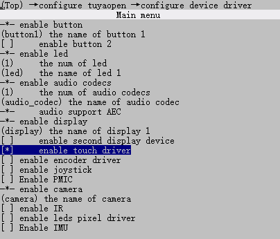
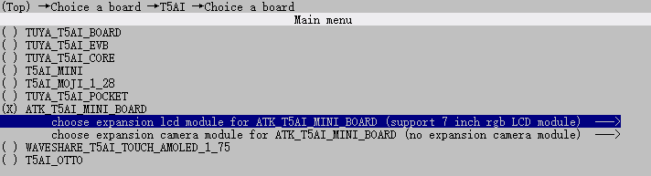
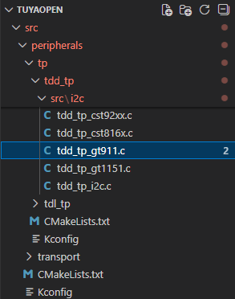

# TOUCH实验

## 前言

本章实验将介绍如何使用TuyaOpen让T5驱动RGBLCD显示屏的触摸屏。

## 操作流程

使用touch组件，需要打开触摸驱动的使能宏，操作如下：

```
tos.py config menu
```

然后到configure device driver中使能touch。



记得最后要保存。

方便快捷直接使用 `tos.py config choice`命令选择生成好的配置文件。

## 触摸屏介绍

### 概述

触摸屏是在显示屏的基础上，在屏幕或屏幕上方分布一层与屏幕大小相近的传感器形成的组合器件。触摸和显示功能由软件控制，可以独立也可以组合实现，用户可以通过侦测传感器的触点再配合相应的软件实现触摸效果。目前最常用的触摸屏有两种，电阻式触摸屏和电容式触摸屏。

2.4寸SPILCD显示模块是没有触摸屏的，而7寸RGBLCD显示模块是带有电容触摸屏的。

电容触摸屏一般都需要一个驱动IC来检测电容触摸，7寸电容触摸屏使用的是IIC接口输出触摸数据的触摸芯片-GT911。

驱动触摸屏，实质就是驱动触摸驱动芯片。

## 操作流程

这里用到的是7寸800480的RGBLCD屏幕，所以得在菜单中选择对屏幕。

```
tos.py config menu
```

然后到configure device driver中使能display。


还需要选择对应的屏幕类型，7寸RGBLCD。



记得最后要保存。

方便快捷直接使用 `tos.py config choice`命令选择生成好的配置文件。

我们要在TuyaOpen中驱动触摸屏，首先看看是否支持该芯片型号，可以到

TuyaOpen/src/peripherals/touch/tdd_touch路径下，查看TuyaOpen适配的触摸驱动芯片。



非常幸运，支持触摸驱动芯片GT911，所以我们可以直接调用对应函数接口即可。若没有支持，也可照葫芦画瓢。

## API 描述
 
**1，tdd_tp_i2c_gt911_register函数**

​	把GT911设备注册到触摸设备中。

```C
OPERATE_RET tdd_tp_i2c_gt911_register(char *name, TDD_TP_GT911_INFO_T *cfg);
```

​	**1.1 参数描述**

|  形参   |             描述             |
| :-----: | :--------------------------: |
|  name   |         设备名称         |
| cfg | 指向GT911设备信息配置结构的指针 |

​	`name`：屏幕设备名称：

​	`cfg`：触摸芯片信息配置结构。

```C
/* TuyaOpen/src/peripherals/display/tdd_display/include/tdd_display_rgb.h */
typedef struct {
    TUYA_RGB_BASE_CFG_T         cfg;
    TUYA_DISPLAY_BL_CTRL_T      bl;
    TUYA_DISPLAY_IO_CTRL_T      power;
    TDD_DISPLAY_SEQ_INIT_CB     init_cb; 
    TUYA_DISPLAY_ROTATION_E     rotation;
    bool                        is_swap; 
}TDD_DISP_RGB_CFG_T;
```

​	**1.2 返回值**

​	OPRT_OK表示成功。关于其他错误，请参考`tuya_error_code.h`。

**2，__tdd_i2c_gt911_open函数**

​	打开gt911触摸设备。

```C
static OPERATE_RET __tdd_i2c_gt911_open(TDD_TP_DEV_HANDLE_T device);
```

​	**2.1 参数描述**

​	`device`：触摸设备控制句柄

​	**2.2 返回值**

​	OPRT_OK表示成功。关于其他错误，请参考`tuya_error_code.h`。

**3，__tdd_i2c_gt911_read函数**

​	读取GT911设备的坐标信息。

```C
static OPERATE_RET __tdd_i2c_gt911_read(TDD_TP_DEV_HANDLE_T device, uint8_t max_num, TDL_TP_POS_T *point, uint8_t *point_num);
```

​	**3.1 参数描述**

​	`device`：触摸设备控制句柄

​	`max_num`：坐标点数量

​	`point`：坐标点的数据

​	`point_num`：读取到的点数

​	**3.2 返回值**

​	OPRT_OK表示成功。关于其他错误，请参考`tuya_error_code.h`。

**4，tdl_tp_device_register函数**

​	触摸设备注册函数。

```C
OPERATE_RET tdl_tp_device_register(char *name, TDD_TP_DEV_HANDLE_T tdd_hdl, TDL_TP_CONFIG_T *tp_cfg, TDD_TP_INTFS_T *intfs);
```

​	**4.1 参数描述**

​	`name`：触摸设备名字

​	`device`：触摸设备控制句柄

​	`tp_cfg`：坐标的配置信息

​	`intfs`：接口回调函数

​	**4.2 返回值**

​	OPRT_OK表示成功。关于其他错误，请参考`tuya_error_code.h`。

**5，tdl_tp_find_dev函数**

​	根据设备名称查找设备控制句柄。

```C
TDL_TP_HANDLE_T tdl_tp_find_dev(char *name);
```

​	**5.1 参数描述**

​	`name`：触摸设备名字

​	**5.2 返回值**

​	OPRT_OK表示成功。关于其他错误，请参考`tuya_error_code.h`。

**6，tdl_tp_dev_open函数**

​	打开触摸设备。

```C
OPERATE_RET tdl_tp_dev_open(TDL_TP_HANDLE_T tp_hdl);
```

​	**6.1 参数描述**

​	`tp_hdl`：触摸设备句柄

​	**6.2 返回值**

​	OPRT_OK表示成功。关于其他错误，请参考`tuya_error_code.h`。

**7，tdl_tp_dev_read函数**

​	打开触摸设备。

```C
OPERATE_RET tdl_tp_dev_read(TDL_TP_HANDLE_T tp_hdl, uint8_t max_num, TDL_TP_POS_T *point, uint8_t *point_num);
```

​	**7.1 参数描述**

​	`tp_hdl`：触摸设备句柄

​	`max_num`：坐标点数量

​	`point`：坐标点的数据

​	`point_num`：读取到的点数

​	**7.2 返回值**

​	OPRT_OK表示成功。关于其他错误，请参考`tuya_error_code.h`。

## 硬件设计

### 例程功能

1，实现一个画板功能。

### 硬件资源

1，RGBLCD

​	LCD_R3: P23

​	LCD_R4: P22

​	LCD_R5: P21

​	LCD_R6: P20

​	LCD_R7: P19

​	LCD_G2: P42

​	LCD_G3: P41

​	LCD_G4: P40

​	LCD_G5: P26

​	LCD_G6: P25

​	LCD_G7: P24

​	LCD_B3: P47

​	LCD_B4: P46

​	LCD_B5: P45

​	LCD_B6: P44

​	LCD_B7: P43

​	LCD_PCLK: P14

​	LCD_DE: P16

​	LCD_BL: P9

​	LCD_RST: P27

2，TOUCH

​	CT_RST: P6

​	CT_INT: P28

​	IIC_SCL: P13

​	IIC_SDA: P15

### 原理图

正点原子T5 AI开发板上RGBLCD的连接原理图，如下图所示。


接线方面需要注意，如下图所示。


RGBLCD屏幕的FPC排线金属接口侧需要朝T5小系统板的TypeC方向接入竖立的FPC座子，并需要按下锁住固定。

## 程序设计

### 1，TOUCH驱动代码

这里我们只讲解核心代码，详细的源码请大家参考光盘资料本实验对应的源码。TOUCH驱动源码包括两个文件：touch.c和touch.h

touch.h文件是对TOUCH引脚做了相关定义以及函数声明。

```C
#define CT_MAX_TOUCH        5

typedef struct
{
    uint8_t  sta;
    uint8_t  point_num;
    uint16_t x[CT_MAX_TOUCH];
    uint16_t y[CT_MAX_TOUCH];
} _touchpad_dev;

extern _touchpad_dev tp_dev;

/* Function Declaration */
OPERATE_RET tdd_disp_atk_touchpad_register(void);
void touchpad_scan(void);
```

touch.c文件是对触摸驱动芯片初始化。

```C
static TDL_TP_HANDLE_T sg_touch_hdl = NULL;      /* Handle for touch device */
_touchpad_dev tp_dev;   

/**
 * @brief Initialize and register the touchpad device
 *
 * This function finds and opens the touch device, preparing it for use.
 * It performs the following operations:
 * 1. Searches for the touch device by name (DISPLAY_NAME)
 * 2. Opens the touch device handle
 * 3. Stores the device handle globally for subsequent operations
 *
 * @param None
 *
 * @return OPERATE_RET
 *         - OPRT_OK: Touchpad initialized successfully
 *         - OPRT_NOT_FOUND: Touch device not found or failed to open
 *
 * @note This function must be called before using touchpad_scan()
 * @note The touch device handle is stored in the global variable sg_touch_hdl
 */
OPERATE_RET tdd_disp_atk_touchpad_register(void)
{
    OPERATE_RET rt = OPRT_OK;

    sg_touch_hdl = tdl_tp_find_dev(DISPLAY_NAME);
    if(NULL == sg_touch_hdl) {
        PR_ERR("touch dev %s not found", DISPLAY_NAME);
        return OPRT_NOT_FOUND;
    }

    rt = tdl_tp_dev_open(sg_touch_hdl);
    if(rt != OPRT_OK) {
        PR_ERR("open touch dev failed, rt: %d", rt);
        return OPRT_NOT_FOUND;
    }

    PR_DEBUG("Touchpad initialized successfully");

    return OPRT_OK;
}

/**
 * @brief Scan touchpad and update touch state immediately
 * @note  No internal delay - call frequency controlled by caller
 *        Supports up to CT_MAX_TOUCH (5) touch points
 */
void touchpad_scan(void)
{
    static uint8_t last_sta = 0;
    uint8_t point_num = 0;
    TDL_TP_POS_T points[CT_MAX_TOUCH];

    /* Read touch data from device immediately */
    tdl_tp_dev_read(sg_touch_hdl, CT_MAX_TOUCH, points, &point_num);
 
    /* Update touch state and data */
    if (point_num > 0 && point_num <= CT_MAX_TOUCH)
    {
        tp_dev.sta = 1;                 /* Touch detected */
        tp_dev.point_num = point_num;

        /* Update all touch points */ 
        for (uint8_t i = 0; i < point_num; i++)
        {
            tp_dev.x[i] = points[i].x;
            tp_dev.y[i] = points[i].y;
        }

        /* Debug: print on touch state change */ 
        if (last_sta == 0)
        {
            // PR_DEBUG("Touch detected: %d point(s) at (%d, %d)", point_num, tp_dev.x[0], tp_dev.y[0]);
        }
        last_sta = 1;
    }
    else
    {
        /* Debug: print on release */
        if (last_sta == 1)
        {
            // PR_DEBUG("Touch released");
        }

        /* No touch detected - clear state immediately */ 
        tp_dev.sta = 0;
        tp_dev.point_num = 0;
        last_sta = 0;
    }
}
```

上述源码中，tdd_disp_atk_touchpad_register函数用来触摸驱动芯片初始化，然后touchpad_scan函数用来触摸扫描函数，坐标数据保存到tp_dev结构体变量中。

在“boards\T5AI\ATK_T5AI_MINI_BOARD\board_ex_module.c”文件还有一部分代码

```c
static OPERATE_RET __board_register_display(void)
{
    OPERATE_RET rt = OPRT_OK;
    ATK_T5AI_DISP_MD0700R_CFG_T display_cfg;

    memset(&display_cfg, 0, sizeof(ATK_T5AI_DISP_MD0700R_CFG_T));

    display_cfg.width     = BOARD_LCD_WIDTH;
    display_cfg.height    = BOARD_LCD_HEIGHT;
    display_cfg.rotation  = BOARD_LCD_ROTATION;

    display_cfg.bl.type              = BOARD_LCD_BL_TYPE;
    display_cfg.bl.gpio.pin          = BOARD_LCD_BL_PIN;
    display_cfg.bl.gpio.active_level = BOARD_LCD_BL_ACTIVE_LV;

    display_cfg.rst.pin          = BOARD_LCD_RST_PIN;
    display_cfg.rst.active_level = BOARD_LCD_RST_ACTIVE_LV;

    display_cfg.power.pin = BOARD_LCD_POWER_PIN;

    TUYA_CALL_ERR_RETURN(atk_t5ai_disp_rgb_md0700r_register(DISPLAY_NAME, &display_cfg));

    TDD_TP_GT911_INFO_T touch_cfg = {
        .i2c_cfg =
            {
                .port = BOARD_TOUCH_I2C_PORT,
                .scl_pin = BOARD_TOUCH_I2C_SCL_PIN,
                .sda_pin = BOARD_TOUCH_I2C_SDA_PIN,
            },
        .tp_cfg =
            {
                .x_max = BOARD_LCD_WIDTH,
                .y_max = BOARD_LCD_HEIGHT,
                .flags =
                    {
                        .mirror_x = 0,
                        .mirror_y = 0,
                        .swap_xy = 0,
                    },
            },
    };

    TUYA_CALL_ERR_RETURN(tdd_tp_i2c_gt911_register(DISPLAY_NAME, &touch_cfg));

    return rt;
}
```

### 2，CMakeLists.txt文件

CMakeLists.txt文件配置内容如下。

```
# Add Driver
set(src_dirs
    TFTLCD		# 添加驱动组件
    TOUCH
)

foreach(dir ${src_dirs})
    set(SRC_DIR ${APP_PATH}/components/BSP/${dir})
    aux_source_directory(${SRC_DIR} DRIVE_SRC)
    target_sources(${EXAMPLE_LIB}
        PRIVATE
            ${DRIVE_SRC}
    )
    target_include_directories(${EXAMPLE_LIB}
        PRIVATE
            ${SRC_DIR}
    )
endforeach()

```

### 3，main.c驱动代码

在main.c里面编写如下代码。

```C
#include "tal_api.h"
#include "tkl_output.h"
#include "tal_cli.h"
#include "test.h"
#include "tftlcd.h"
#include "touch.h"

/**
 * @brief       Clear screen and display "RST" in top-right corner
 * @param       None
 * @retval      None
 */
void load_draw_dialog(void)
{
    tftlcd_clear(WHITE);                                                    /* Clear screen */
    tftlcd_show_string(tftdev.width - 48, 0, 200, 32, 32, "RST", BLUE);     /* Display reset area */
}

/**
 * @brief       Draw circle directly in framebuffer (without screen refresh)
 * @param       center_x,center_y: Center coordinates
 * @param       radius: Radius
 * @param       color: Color
 * @retval      None
 */
void lcd_fill_circle_no_flush(uint16_t center_x, uint16_t center_y, uint16_t radius, uint16_t color)
{
    if (tftdev.display_fb == NULL) return;

    uint16_t *fb = (uint16_t *)tftdev.display_fb->frame;
    uint16_t width = tftdev.display_fb->width;
    uint16_t height = tftdev.display_fb->height;

    /* Use fast circle filling algorithm */
    int x = radius;
    int y = 0;
    int radiusError = 1 - x;

    while (x >= y)
    {
        /* Draw 8 symmetrical horizontal line segments */ 
        for (int i = center_x - x; i <= center_x + x; i++)
        {
            if (i >= 0 && i < width)
            {
                if (center_y + y < height) fb[(center_y + y) * width + i] = color;
                if (center_y - y < height && center_y >= y) fb[(center_y - y) * width + i] = color;
            }
        }
        for (int i = center_x - y; i <= center_x + y; i++)
        {
            if (i >= 0 && i < width)
            {
                if (center_y + x < height) fb[(center_y + x) * width + i] = color;
                if (center_y - x < height && center_y >= x) fb[(center_y - x) * width + i] = color;
            }
        }

        y++;
        if (radiusError < 0)
        {
            radiusError += 2 * y + 1;
        }
        else
        {
            x--;
            radiusError += 2 * (y - x + 1);
        }
    }
}

/**
 * @brief       Draw thick line (batch operation, single refresh at end)
 * @param       x1,y1: Start point coordinates
 * @param       x2,y2: End point coordinates
 * @param       size : Line thickness
 * @param       color: Line color
 * @retval      None
 */
void lcd_draw_bline(uint16_t x1, uint16_t y1, uint16_t x2, uint16_t y2, uint8_t size, uint32_t color)
{
    int16_t dx = x2 - x1;
    int16_t dy = y2 - y1;

    /* Calculate distance (using Manhattan distance) */
    uint16_t distance = (abs(dx) > abs(dy)) ? abs(dx) : abs(dy);

    /* If distance is 0, draw only one point */
    if (distance == 0)
    {
        lcd_fill_circle_no_flush(x1, y1, size, color);
    }
    else
    {
        /* Aggressive overlap strategy for fast movements (26-30px gaps detected)
           Spacing = 0.35 * radius ensures 65% overlap for continuous lines */
        uint16_t steps;

        /*  Calculate steps based on circle spacing = 0.35 * radius
            For radius=8, spacing=2.8px, can handle up to 40px gaps smoothly */
        if (distance <= size)
        {
            steps = distance;  // Very short lines: draw every pixel
        }
        else
        {
            /* Optimal spacing = 0.35 * radius (65% overlap) */ 
            /* steps = distance / (0.35 * size) = distance / (size * 0.35) = (distance * 100) / (size * 35) */ 
            steps = (distance * 100) / (size * 35);

            /* Ensure minimum density: at least 1 circle per 3 pixels */
            if (steps < distance / 3) steps = distance / 3;
        }

        /* Use floating-point interpolation to ensure smooth continuity */
        for (uint16_t i = 0; i <= steps; i++)
        {
            /* Linear interpolation to calculate current point position */
            float t = (float)i / (float)steps;
            int16_t x = x1 + (int16_t)(dx * t + 0.5f);  /* Add 0.5 for rounding */ 
            int16_t y = y1 + (int16_t)(dy * t + 0.5f);

            lcd_fill_circle_no_flush(x, y, size, color);
        }
    }

    /* After all circles are drawn, refresh screen once */
    if (tftdev.display_fb && tftdev.disp_hdl)
    {
        tdl_disp_dev_flush(tftdev.disp_hdl, tftdev.display_fb);
    }
}

/* Brush parameter configuration */
#define BRUSH_SIZE      8       /* Brush size (radius), increased to handle 20-30px gaps during fast sliding */

/* Colors for 5 touch points (for capacitive touch screen) */
const uint32_t POINT_COLOR_TBL[5] = {RED, GREEN, BLUE, YELLOW, BLACK};

void ctp_test(void)
{
    uint8_t t = 0;
    uint16_t lastpos[10][2];    /* Last recorded data */
    uint8_t maxp = 5;

    /* Initialize lastpos array */ 
    for (t = 0; t < 10; t++)
    {
        lastpos[t][0] = 0xFFFF;
        lastpos[t][1] = 0xFFFF;
    }

    load_draw_dialog();  /* Initialize display */ 

    while (1)
    {
        touchpad_scan();
        uint8_t need_flush = 0;  /* Flag for screen refresh requirement */ 

        /* Process only when touch detected */ 
        if (tp_dev.sta)
        {
            /* Iterate through all detected touch points */
            for (t = 0; t < tp_dev.point_num && t < maxp; t++)
            {
                /* Check if coordinates are within screen bounds */
                if (tp_dev.x[t] < tftdev.width && tp_dev.y[t] < tftdev.height)
                {
                    /* Check if RST area in top-right corner was clicked */
                    if (tp_dev.x[t] > (tftdev.width - 48) && tp_dev.y[t] < 40)
                    {
                        load_draw_dialog();
                        /* Clear all lastpos to avoid lines after screen clear */
                        for (uint8_t i = 0; i < maxp; i++)
                        {
                            lastpos[i][0] = 0xFFFF;
                            lastpos[i][1] = 0xFFFF;
                        }
                        need_flush = 0;  /* Screen clear operation already refreshed */
                        break;
                    }

                    /* If first touch of this point, record position directly */
                    if (lastpos[t][0] == 0xFFFF)
                    {
                        lastpos[t][0] = tp_dev.x[t];
                        lastpos[t][1] = tp_dev.y[t];
                        /* Draw a point on first touch (without refresh) */
                        lcd_fill_circle_no_flush(lastpos[t][0], lastpos[t][1], BRUSH_SIZE, POINT_COLOR_TBL[t]);
                        need_flush = 1;
                    }
                    else
                    {
                        /* Calculate distance for debugging */
                        int16_t dist_x = tp_dev.x[t] - lastpos[t][0];
                        int16_t dist_y = tp_dev.y[t] - lastpos[t][1];
                        uint16_t dist = (abs(dist_x) > abs(dist_y)) ? abs(dist_x) : abs(dist_y);

                        /* Debug: print if distance is large (indicates fast movement) */
                        if (dist > 20)
                        {
                            PR_DEBUG("Fast movement detected: dist=%d, from(%d,%d) to(%d,%d)",
                                     dist, lastpos[t][0], lastpos[t][1], tp_dev.x[t], tp_dev.y[t]);
                        }

                        /* Draw line from last position to current position (refreshes internally) */
                        lcd_draw_bline(lastpos[t][0], lastpos[t][1],
                                      tp_dev.x[t], tp_dev.y[t],
                                      BRUSH_SIZE, POINT_COLOR_TBL[t]);

                        /* Update last position of this point */
                        lastpos[t][0] = tp_dev.x[t];
                        lastpos[t][1] = tp_dev.y[t];
                        need_flush = 0;  /* lcd_draw_bline already refreshed internally */
                    }
                }
            }

            /* Clear unused touch points */
            for (t = tp_dev.point_num; t < maxp; t++)
            {
                lastpos[t][0] = 0xFFFF;
                lastpos[t][1] = 0xFFFF;
            }
        }
        else
        {
            /* Clear all lastpos when no touch */
            for (t = 0; t < maxp; t++)
            {
                lastpos[t][0] = 0xFFFF;
                lastpos[t][1] = 0xFFFF;
            }
        }

        /* If screen refresh needed (on first touch) */
        if (need_flush && tftdev.display_fb && tftdev.disp_hdl)
        {
            tdl_disp_dev_flush(tftdev.disp_hdl, tftdev.display_fb);
        }

        /* Completely remove delay to maximize sampling rate and eliminate breaks during fast sliding */
        // tal_system_sleep(1);
    }
}


/**
 * @brief       user_main
 *
 * @param[in]   none
 * @return      none
 */
void user_main(void)
{
    tal_log_init(TAL_LOG_LEVEL_DEBUG, 1024, (TAL_LOG_OUTPUT_CB)tkl_log_output); /* Initialize log output */   
    tdd_disp_atk_tftlcd_register();     /* Register the TFTLCD LCD display */
    tdd_disp_atk_touchpad_register();   /* Register the TOUCHTAP */
    ctp_test();                         /* cap touchpad test */
}

/**
 * @brief       main
 *
 * @param       argc
 * @param       argv
 * @return      none
 */
#if OPERATING_SYSTEM == SYSTEM_LINUX
void main(int argc, char *argv[])
{
    user_main();

    while (1) {
        tal_system_sleep(500);
    }
}
#else

/**
 * @brief       The application entry point
 * 
 * @param[in]   none
 * @return      none
 */
void tuya_app_main(void)
{
    user_main();
}

#endif
```

从user_main函数可以看到，初始化屏幕和触摸屏后，跳入ctp_test函数中，不断扫描触摸，实现触摸画板功能。

## 运行验证

程序下载完成后，在触摸屏上触摸，就能把对应的点描画出来。
