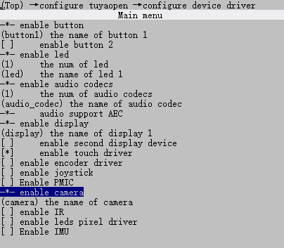
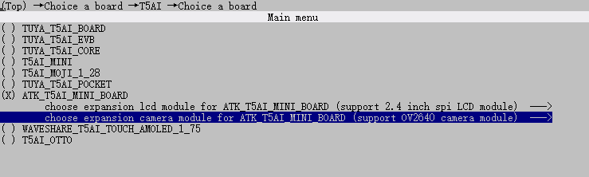

# 摄像头实验

## 前言

本章实验将介绍如何使用TuyaOpen让T5驱动camera（OV2640）,并把图像显示在LCD上。

## 操作流程

使用camera组件，需要打开camera的使能宏，操作如下：

```
tos.py config menu
```

然后到configure device driver中使能camera。



还需要选择对应的摄像头，OV2640。



记得最后要保存。

方便快捷直接使用 `tos.py config choice`命令选择生成好的配置文件。

## 摄像头驱动介绍

### 概述

TuyaOpen CAMERA 组件是一个高度抽象化的统一管理接口，旨在解决不同型号摄像头在硬件能力、通信协议和数据格式上的差异。它为上层应用提供了一套标准化的API，从而实现对各类摄像头设备的无缝接入、功能调用和集中管控。

## API 描述

**1，tdl_camera_find_dev函数**

查找摄像头设备。

```C
TDL_CAMERA_HANDLE_T tdl_camera_find_dev(char *name);
```

**1.1 参数描述**

`name`：摄像头名称

**1.2 返回值**

OPRT_OK表示解码成功，其他表示解码失败。

**2，tdl_camera_dev_open函数**

打开摄像头设备。

```C
OPERATE_RET tdl_camera_dev_open(TDL_CAMERA_HANDLE_T camera_hdl,  TDL_CAMERA_CFG_T *cfg);
```

**2.1 参数描述**

`camera_hdl`：摄像头句柄

`cfg`：参数配置。

```C
/* 摄像头输出格式类型 */
typedef enum {
    TDL_CAMERA_FMT_YUV422 = 1,
    TDL_CAMERA_FMT_JPEG = ENCODED_SHIFT(1),
    TDL_CAMERA_FMT_H264 = ENCODED_SHIFT(2),
    TDL_CAMERA_FMT_JPEG_YUV422_BOTH =  (TDL_CAMERA_FMT_JPEG | TDL_CAMERA_FMT_YUV422),
    TDL_CAMERA_FMT_H264_YUV422_BOTH =  (TDL_CAMERA_FMT_H264 | TDL_CAMERA_FMT_YUV422),
} TDL_CAMERA_FMT_E;

typedef OPERATE_RET (*TDL_CAMERA_GET_FRAME_CB)(TDL_CAMERA_HANDLE_T hdl,  TDL_CAMERA_FRAME_T *frame);

typedef struct {
    uint16_t                  fps;					/* 输出帧率 */
    uint16_t                  width;				/* 输出宽度 */
    uint16_t                  height;				/* 输出高度 */
    TDL_CAMERA_FMT_E          out_fmt;				/* 输出格式 */
    TDL_CAMERA_GET_FRAME_CB   get_frame_cb;			/* 回调解码函数 */
    TDL_CAMERA_GET_FRAME_CB   get_encoded_frame_cb;	/* 图像编码回调函数 */
}TDL_CAMERA_CFG_T;
```

**2.2 返回值**

OPRT_OK表示成功，其他表示失败。

**3，tkl_dma2d_init函数**

DMA2D初始化。

```C
OPERATE_RET tkl_dma2d_init(CONST TUYA_DMA2D_BASE_CFG_T *cfg);
```

**3.1 参数描述**

`cfg`：DMA2D基础配置

```C
typedef VOID_T (*TUYA_DMA2D_IRQ_CB)(TUYA_DMA2D_IRQ_E type, VOID_T *args);

/**
 * @brief dma2d interrupt config
 */
typedef struct {
    TUYA_DMA2D_IRQ_CB     cb;	/* DMA2D回调函数 */
    VOID_T              *arg;	/* DMA2D回调函数传入参数 */
} TUYA_DMA2D_BASE_CFG_T;
```

**3.2 返回值：**

OPRT_OK表示成功，其他表示失败。

**4，tkl_dma2d_convert函数**

格式转换。

```C
OPERATE_RET tkl_dma2d_convert(TKL_DMA2D_FRAME_INFO_T *src, TKL_DMA2D_FRAME_INFO_T *dst);
```

**4.1 参数描述**

`src`：源图像数据

`dst`：目标图像输出配置参数

```C
typedef struct
{
    UINT16_T      x_axis;
    UINT16_T      y_axis;
}TKL_DMA2D_POINT_T;

typedef struct
{
    TUYA_FRAME_FMT_E type;                           	/* 转换类型 */
    uint8_t     *pbuf;                                	/* 转转后存储的地址 */
    UINT16_T     width;                                	/* 宽度 */
    UINT16_T     height;                               	/* 高度 */
    TKL_DMA2D_POINT_T  axis;                         	/* 坐标偏移 */
    UINT16_T     width_cp;                             	
    UINT16_T     height_cp;                            	
}TKL_DMA2D_FRAME_INFO_T;
```

**4.2 返回值：**

OPRT_OK表示成功，其他表示失败。

**5，tkl_dma2d_convert函数**

是否需要两个字节转换。

```C
OPERATE_RET tdl_disp_dev_rgb565_swap(uint16_t *data, uint32_t len);
```

**5.1 参数描述**

`data`：需要转换的数据

`len`：需要转换的大小（像素的个数）

**5.2 返回值：**

OPRT_OK表示成功，其他表示失败。

## 硬件设计

### 例程功能

1，测试摄像头驱动，并把图像显示在LCD上。

### 硬件资源

1，RGBLCD

​	LCD_R3: P23

​	LCD_R4: P22

​	LCD_R5: P21

​	LCD_R6: P20

​	LCD_R7: P19

​	LCD_G2: P42

​	LCD_G3: P41

​	LCD_G4: P40

​	LCD_G5: P26

​	LCD_G6: P25

​	LCD_G7: P24

​	LCD_B3: P47

​	LCD_B4: P46

​	LCD_B5: P45

​	LCD_B6: P44

​	LCD_B7: P43

​	LCD_PCLK: P14

​	LCD_DE: P16

​	LCD_BL: P9

​	LCD_RST: P27

2，SPILCD

​	DC/WR: P42

​	RST: P43

​	CS: P45

​	SCK: P44

​	SDA: P46

​	BL/PWR: P9

3，CAMERA

​	DVP_VSYNC:P31

​	DVP_HSYNC:P30

​	DVP_RST:P8

​	DVP_D0:P32

​	DVP_D1:P33

​	DVP_D2:P34

​	DVP_D3:P35

​	DVP_D4:P36

​	DVP_D5:P37

​	DVP_D6:P38

​	DVP_D7:P39

​	DVP_PCLK:P29

​	DVP_PWDN:P7

​	IIC_SCL:P13

​	IIC_SDA:P15

### 原理图

正点原子T5 AI开发板上CAMERA的连接原理图，如下图所示。


## 程序设计

### 1，CAMERA驱动代码

这里我们只讲解核心代码，详细的源码请大家参考光盘资料本实验对应的源码。CAMERA驱动源码包括两个文件：camera.c和camera.h

camera.h文件是对函数声明。

```C
/* Function Declaration */
OPERATE_RET camera_init(void);
```

camera.c文件是对摄像头初始化且完成摄像头数据显示在屏幕上的操作。

```C
#if defined(ATK_T5AI_MINI_BOARD_LCD_MD0700R_RGB)
#define CAMERA_FPS                20
#define CAMERA_WIDTH              480
#define CAMERA_HEIGHT             480
#else
#define CAMERA_FPS                40
#define CAMERA_WIDTH              240
#define CAMERA_HEIGHT             240
#endif

extern TDL_DISP_HANDLE_T sg_tdl_disp_hdl;
extern TDL_DISP_FRAME_BUFF_T *sg_p_display_fb;
extern TDL_DISP_DEV_INFO_T sg_display_info;
static TDL_CAMERA_HANDLE_T sg_tdl_camera_hdl = NULL;

#if defined(ENABLE_DMA2D) && (ENABLE_DMA2D == 1)
static TKL_DMA2D_FRAME_INFO_T sg_in_frame = {0};
static TKL_DMA2D_FRAME_INFO_T sg_out_frame = {0};
static SEM_HANDLE sg_convert_sem;
#endif

/**
 * @brief       camera frame callback
 * @param[in]   hdl:camera handle
 * @param[in]   frame:camera frame
 * @return      OPERATE_RET
 */
OPERATE_RET __get_camera_raw_frame_cb(TDL_CAMERA_HANDLE_T hdl,  TDL_CAMERA_FRAME_T *frame)
{
    (void)hdl;

#if defined(ENABLE_DMA2D) && (ENABLE_DMA2D == 1)
    /* Calculate offset to center camera image on screen */
    int x_offset = (sg_p_display_fb->width - CAMERA_WIDTH) / 2;
    int y_offset = (sg_p_display_fb->height - CAMERA_HEIGHT) / 2;

    /* Input frame: YUV422 from camera */
    sg_in_frame.type = TUYA_FRAME_FMT_YUV422;
    sg_in_frame.width = CAMERA_WIDTH;
    sg_in_frame.height = CAMERA_HEIGHT;
    sg_in_frame.axis.x_axis = 0;
    sg_in_frame.axis.y_axis = 0;
    sg_in_frame.width_cp = CAMERA_WIDTH;
    sg_in_frame.height_cp = CAMERA_HEIGHT;
    sg_in_frame.pbuf = frame->data;

    /* Output frame: RGB565 to display buffer (centered) */
    sg_out_frame.type = TUYA_FRAME_FMT_RGB565;
    sg_out_frame.width = sg_p_display_fb->width;
    sg_out_frame.height = sg_p_display_fb->height;
    sg_out_frame.axis.x_axis = x_offset > 0 ? x_offset : 0;
    sg_out_frame.axis.y_axis = y_offset > 0 ? y_offset : 0;
    sg_out_frame.width_cp = CAMERA_WIDTH;
    sg_out_frame.height_cp = CAMERA_HEIGHT;
    sg_out_frame.pbuf = sg_p_display_fb->frame;

    tkl_dma2d_convert(&sg_in_frame, &sg_out_frame); /* convert yuv422 to rgb565 */

    tal_semaphore_wait_forever(sg_convert_sem);     /* wait dma2d convert done */

    if(sg_display_info.is_swap) 
    {
        tdl_disp_dev_rgb565_swap((uint16_t *)sg_p_display_fb->frame, sg_p_display_fb->len/2);    /* swap rgb565 */
    }

    tdl_disp_dev_flush(sg_tdl_disp_hdl, sg_p_display_fb);    /* display frame */
#endif

    return OPRT_OK;
}

#if defined(ENABLE_DMA2D) && (ENABLE_DMA2D == 1)
/**
 * @brief       dma2d irq callback
 * @param[in]   type:irq type
 * @param[in]   args: args
 * @return      none
 */
static void __dma2d_irq_cb(TUYA_DMA2D_IRQ_E type, VOID_T *args)
{
    (void)type;
    (void)args;

    if(sg_convert_sem) {
        tal_semaphore_post(sg_convert_sem);
    }
}

/**
 * @brief dma2d init
 * @param[in] None
 * @return none
 */
static OPERATE_RET __dma2d_init(void)
{
    OPERATE_RET rt = OPRT_OK;

    TUYA_CALL_ERR_RETURN(tal_semaphore_create_init(&sg_convert_sem, 0, 1)); /* create semaphore */

    TUYA_DMA2D_BASE_CFG_T dma2d_cfg = {
        .cb = __dma2d_irq_cb, 
        .arg=NULL,
    };

    return tkl_dma2d_init(&dma2d_cfg);  /* init dma2d */
}
#endif

/**
 * @brief       camera init
 * @param[in]   None
 * @retval      OPRT_OK:success
 */
OPERATE_RET camera_init(void)
{
    OPERATE_RET rt = OPRT_OK;
    TDL_CAMERA_CFG_T cfg;

#if defined(ENABLE_DMA2D) && (ENABLE_DMA2D == 1)
    TUYA_CALL_ERR_LOG(__dma2d_init());
#endif

    sg_tdl_camera_hdl = tdl_camera_find_dev(CAMERA_NAME);   /* Find camera device */
    if(NULL == sg_tdl_camera_hdl) {
        PR_ERR("camera dev %s not found", CAMERA_NAME);
        return OPRT_NOT_FOUND;
    }

    /* Camera configuration */
    cfg.fps     = CAMERA_FPS;
    cfg.width   = CAMERA_WIDTH;
    cfg.height  = CAMERA_HEIGHT;
    cfg.out_fmt = TDL_CAMERA_FMT_YUV422;
    cfg.get_frame_cb = __get_camera_raw_frame_cb;

    TUYA_CALL_ERR_RETURN(tdl_camera_dev_open(sg_tdl_camera_hdl, &cfg)); /* Open camera device */

    return OPRT_OK;
}
```

上述源码中，camera_init函数用来初始化摄像头，然后__get_camera_raw_frame_cb函数用来更新图像数据到屏幕上，还有dma2d使能的一些函数。

### 2，CMakeLists.txt文件

CMakeLists.txt文件配置内容如下。

```
# Add Driver
set(src_dirs
    TFTLCD		# 添加驱动组件
    CAMERA
)

foreach(dir ${src_dirs})
    set(SRC_DIR ${APP_PATH}/components/BSP/${dir})
    aux_source_directory(${SRC_DIR} DRIVE_SRC)
    target_sources(${EXAMPLE_LIB}
        PRIVATE
            ${DRIVE_SRC}
    )
    target_include_directories(${EXAMPLE_LIB}
        PRIVATE
            ${SRC_DIR}
    )
endforeach()

```

### 3，main.c驱动代码

在main.c里面编写如下代码。

```C
#include "tal_api.h"
#include "tkl_output.h"
#include "board_com_api.h"

#include "tftlcd.h"
#include "camera.h"

/**
 * @brief       user_main
 *
 * @param[in]   param:Task parameters
 * @return      none
 */
void user_main(void)
{
    tal_log_init(TAL_LOG_LEVEL_DEBUG, 1024, (TAL_LOG_OUTPUT_CB)tkl_log_output); /* Initialize log output */   
    tdd_disp_atk_tftlcd_register();    /* Register the TFTLCD LCD display */

    tftlcd_show_string(30, 50, 200, 16, 16, "T5 MINI Board", RED);
    tftlcd_show_string(30, 70, 200, 16, 16, "CAMERA TEST", RED);
    tftlcd_show_string(30, 90, 200, 16, 16, "ATOM@ALIENTEK", RED);

    camera_init();

    while(1) 
    {
        tal_system_sleep(1000);
    }

}

/**
 * @brief       main
 *
 * @param       argc
 * @param       argv
 * @return      none
 */
#if OPERATING_SYSTEM == SYSTEM_LINUX
void main(int argc, char *argv[])
{
    user_main();

    while (1) {
        tal_system_sleep(500);
    }
}
#else

/**
 * @brief       main
 * @param[in]   None
 * @return      none
 */
void tuya_app_main(void)
{
    user_main();
}
#endif
```

从user_main函数可以看到，首先初始化屏幕，后面初始化摄像头。

## 运行验证

程序下载完成后，LCD上显示摄像头图像。
