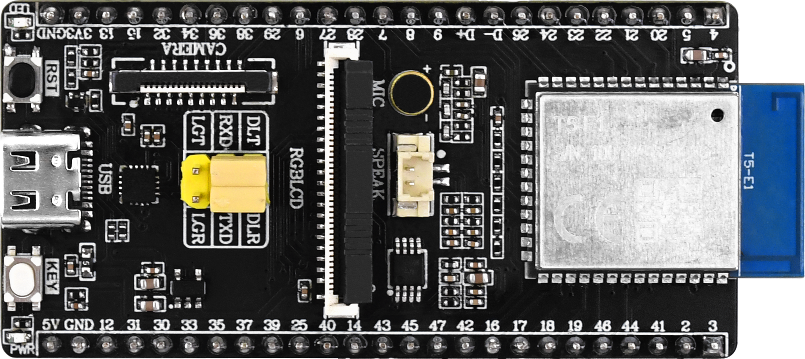
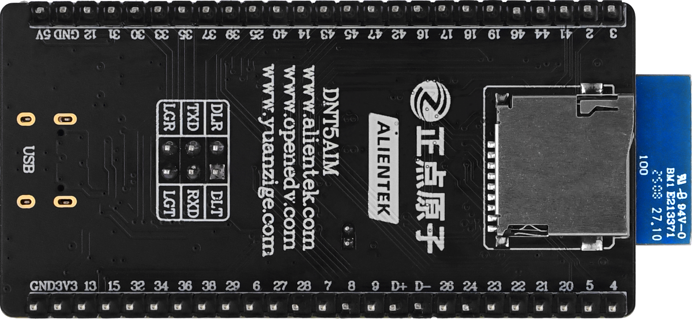

# DNT5M小系统板 开发板

DNT5M小系统板 开发板是正点原子以涂鸦T5-E1模组为核心推出的开发板，主要用于让客户快速搭建AI硬件原型机。同时，凭借其高性价比和强大的扩展性也适合创客和DIY爱好者进行各种项目开发。

T5-E1模组的处理器采用ARMv8-M Star（M33F）架构，主频高达480MHz，内置8MB FLash和16MB RAM，集成2.4GHz WiFi和蓝牙。

## 外观

**正面**

**背面**

DNT5M小系统板 开发板的外观设计简洁而功能性强，采用了标准的矩形电路板形状，整体尺寸较为紧凑，适合嵌入式项目使用。板上布满了多种接口和引脚，可以外接RGBLCD和摄像头，以及两排单边25个引脚排针，支持多种通信协议，如I2C、SPI和UART等。这些接口排列整齐，便于与外部模块和传感器进行连接。板上还配备了USB转串口接口，支持串口通信，适合各种数据交互需求。

DNT5M小系统板整体小巧、美观，其尺寸如下：

| 开发板 | 长（mm）| 宽（mm）|
| --- | --- | --- |
| DNT5M小系统板 | 68 | 33 |

## 接口介绍

DNT5M小系统板引出了多种接口，方便用户开发和使用

| 接口                         | 描述                                                         |
| ---------------------------- | ------------------------------------------------------------ |
| Type-C 接口                  | T5M小系统板上的TypeC口功能主要取决于3x2排座的跳线帽选择，往上连接为下载功能，往下连接为日志打印|
| 2*25引出接口                  | 主要引46个可编程IO + 一个3.3V电源和地 + 一个5V 电源和地 |
| TF 卡槽                      | 用于外接 TF 卡 连接至 T5 的SD接口                |
| RGBLCD接口                   | 用于外接 7寸800480的RGBLCD屏幕                |
| CAMERA接口                   | 用于外接 OV2640摄像头模块                |
| 喇叭座子                     | 用于外接 喇叭                |

### note

板载的Type-C接口某一个时刻只能使用下载功能或者日志功能，使用上会有点不方便。建议板载Type-C口作为下载程序口，而使用**正点原子USB转串口模块**来连接LGT线来使用日志串口。

## 开发板硬件资源

| 硬件                | 描述                                                          |
| ------------------- | ------------------------------------------------------------ |
| T5-E1          | 涂鸦智能推出基于ARMv8-M Star（M33F）架构的模组，主频高达480MHz，内置8MB flash和16MB RAM，支持WIFI和蓝牙 |
| 复位按键       | 用于对 T5 模组进行硬件复位                                |
| 用户按键       | 用户按键，有效电平为低电平		|
| LCD座子     	| 用于连接7寸800480的RGBLCD屏幕                               		|
| CAM座子     	| 用于连接OV2640摄像头                 		|
| PWR           | 电源灯为蓝色                 						|
| LED           | 用户灯为红色                    			|
| MIC           | 用于采集声音              			|
| 功放电路      | 驱动喇叭发出声音 |
| 3x2座子       | 用于选择TypeC口的功能 |
| TypeC口       | 用于下载程序或查看日志 |

## 开发板例程介绍

| 基础例程                   | 描述                                      |
| ------------------------- | ----------------------------------------- |
| 00_base                   | 学习如何创建项目                           |
| 01_led                    | 学习如何使用GPIO                           |
| 02_key                    | 学习如何使用BUTTON组件                     |
| 03_exit                   | 学习如何使用GPIO中断功能                   |
| 04_uart                   | 学习如何使用串口                           |
| 05_timer                  | 学习如何使用定时器                         |
| 06_pwm                    | 学习如何使用PWM                           |
| 07_spilcd                 | 学习如何使用LCD组件驱动SPILCD              |
| 08_rgblcd                 | 学习如何使用LCD组件驱动RGBLCD              |
| 09_touch                  | 学习如何使用TOUCH驱动                      |
| 10_sd                     | 学习如何使用FileSystem驱动TF卡              |
| 11_picture                | 学习如何进行图片解码显示                    | 
| 12_camera                 | 学习如何使用CAM组件驱动OV2640               |
| 13_audio_speaker          | 学习如何使用MINIMP3库播放mp3音乐            |
| 14_audio_recorder         | 学习如何使用WAV编码将音频数据生成wav文件     |

| TuyaOS例程                | 描述                                      |
| ------------------------- | ----------------------------------------- |
| 01_create_thread          | 学习如何创建线程和删除线程                  |
| 02_sw_timer               | 学习如何使用软件定时器                     |
| 03_semaphore              | 学习如何使用信号量                         |
| 04_mutex                  | 学习如何使用互斥信号量                     |
| 05_queue                  | 学习如何使用消息队列                       |
| 06_event                  | 学习如何使用事件标志                       |
| 07_os_kv                  | 学习如何使用flash分区                     |

| 通信例程                   | 描述                                      |
| ------------------------- | ----------------------------------------- |
| 01_ap                     | 学习如何创建wifi热点                           |
| 02_scan                   | 学习如何扫描附近的wifi热点                     |
| 03_sta                    | 学习如何连接到指定的热点设备                          |
| 04_http                   | 学习如何连接WiFi网络并发送HTTP GET请求                |
| 05_https                  | 学习如何连接WiFi网络并发送HTTPS GET请求               |
| 06_tcpserver              | 学习如何创建TCP服务器并与客户端进行通信               |
| 07_tcpclient              | 学习如何连接到TCP服务器并进行数据通信                 |
| 08_mqtt                   | 学习如何连接到阿里云IoT平台进行消息发布和订阅         |
| 09_low_power              | 学习如何控制设备进入和退出低功耗模式以降低能耗        |
| 10_ble_scan               | 学习如何扫描周围的蓝牙低功耗(BLE)设备并解析设备信息   |
| 11_ble_ctrl               | 学习如何通过BLE外设接收手机发送的命令来控制LED        | 

| AIOT例程                   | 描述                                      |
| ------------------------- | ----------------------------------------- |
| switch_demo               | 学习如何连接到涂鸦云服务                    |
| your_chat_bot             | 学习如何制作一个智能聊天机器人               |

| LVGL例程                   | 描述                                      |
| ------------------------- | ----------------------------------------- |
| 00_lvgl_transplant        | 学习LVGL移植                              |
| 01_lvgl_obj               | 学习LVGL lv_obj(基础对象)                 |
| 02_lvgl_arc               | 学习LVGL lv_arc(圆弧)                     |
| 03_lvgl_bar               | 学习LVGL lv_bar(进度条)                   |
| 04_lvgl_btn               | 学习LVGL lv_btn(按键)                     |
| 05_lvgl_btnmatrix         | 学习LVGL lv_btnmartix(按钮矩阵)           |
| 06_lvgl_canvas            | 学习LVGL lv_canvas(画布)                  |
| 07_lvgl_checkbox          | 学习LVGL lv_checkbox(复选框)              |
| 08_lvgl_dropdown          | 学习LVGL lv_dropdown(下拉列表)            |
| 09_lvgl_img               | 学习LVGL lv_img(图片)                      |
| 10_lvgl_label             | 学习LVGL lv_label(标签)                   |
| 11_lvgl_line              | 学习LVGL lv_line(线条)                    | 
| 12_lvgl_roller            | 学习LVGL lv_roller(滚轮)                  |
| 13_lvgl_slider            | 学习LVGL lv_slider(滑块)                  |
| 14_lvgl_switch            | 学习LVGL lv_switch(开关)                  |
| 15_lvgl_table             | 学习LVGL lv_table(表格)                   |
| 16_lvgl_textarea          | 学习LVGL lv_textarea(文本区域)            |
| 17_lvgl_calendar          | 学习LVGL lv_calendar(日历)                |
| 18_lvgl_chart             | 学习LVGL lv_chart(图表)                   |
| 19_lvgl_imgbtn            | 学习LVGL lv_imgbtn(图片按键)              |
| 20_lvgl_keyboard          | 学习LVGL lv_keyboard(键盘)                |
| 21_lvgl_led               | 学习LVGL lv_led(LED)                      |
| 22_lvgl_list              | 学习LVGL lv_list(列表)                    |
| 23_lvgl_msgbox            | 学习LVGL lv_msgbox(消息框)                |
| 24_lvgl_span              | 学习LVGL lv_span(跨度)                    |
| 25_lvgl_spinbox           | 学习LVGL lv_spinbox(微调器)              |
| 26_lvgl_spinner           | 学习LVGL lv_spinner(加载器)               | 
| 27_lvgl_tabview           | 学习LVGL lv_tabview(选项卡)               |
| 28_lvgl_titleview         | 学习LVGL lv_tileview(平铺视图)            |
| 29_lvgl_win               | 学习LVGL lv_win(窗口)                     |
| 30_lvgl_animimg           | 学习LVGL lv_animimg(动画)                 |
| 31_lvgl_menu              | 学习LVGL lv_menu(菜单)                    |
| 32_lvgl_scale             | 学习LVGL lv_scale(仪表盘)                 |

### note

以上例程均提供bin文件，可通过tyutool_gui工具快速下载体验效果。

tyutool_gui工具使用方法请前往[**tyutool 工具介绍**](https://tuyaopen.ai/zh/docs/tos-tools/tools-tyutool)