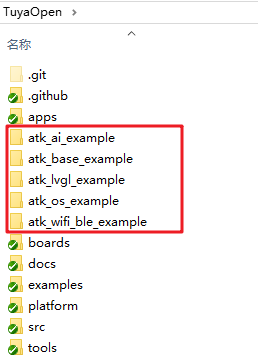

# 代码放置

## 概述

 正点原子T5AI开发板提供基础例程、OS例程、LVGL例程、网络通信例程和AI例程。由于是在TuyaOpen的代码框架下运行的代码，所以例程放置的路径不能随意。

 这里的例程放置位置需要在TuyaOpen的文件夹下，如下图所示。

大家想要进行编译下载，就需要去到对应例程路径下，执行对应的tos命令。

到此，我们已经完成了TuyaOpen的前期准备工作了，接下来就开始代码实战咯。
