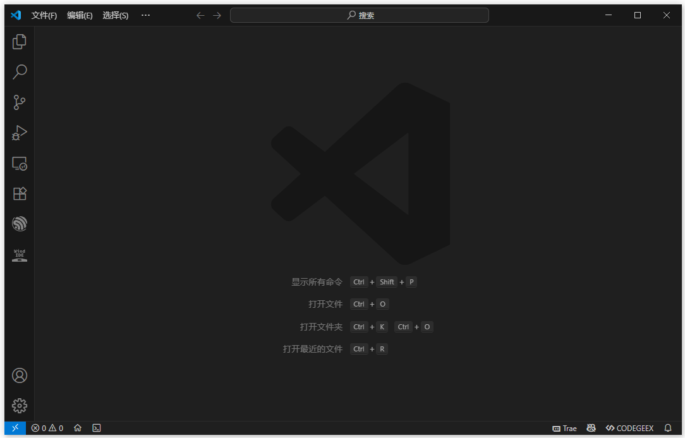
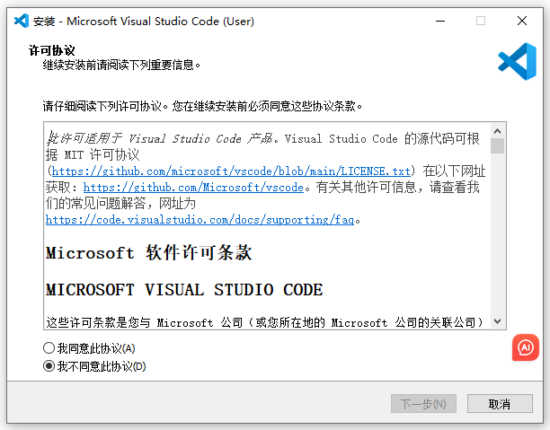
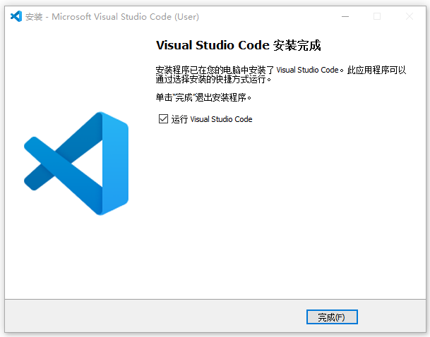
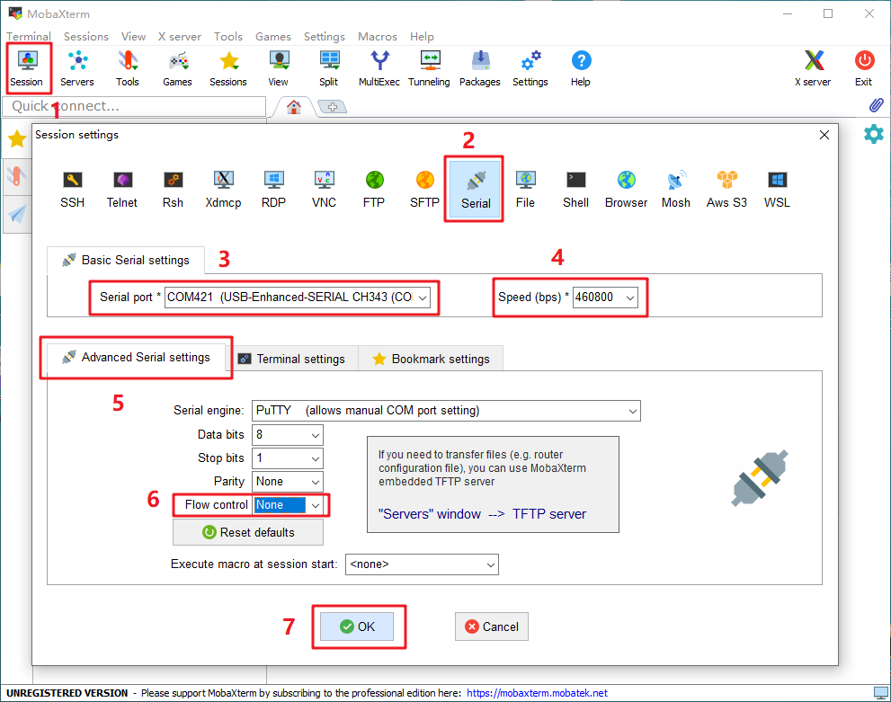
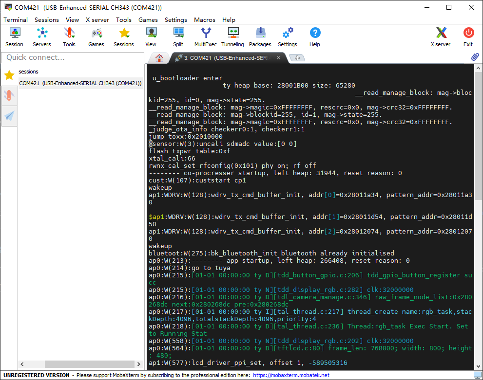
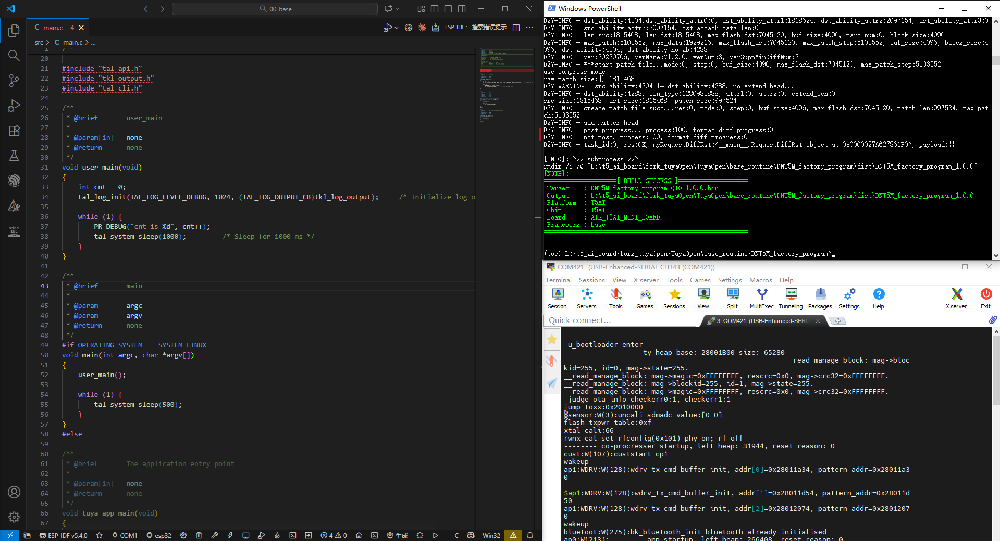

# 必要软件安装

## 概述

现在很多芯片的方法方式倾向于脚本开发，所以我们需要安装一些软件提高开发效果。

## VSCode 软件安装

### 概述

 **[Visual Studio Code](https://code.visualstudio.com/)**（简称 **VSCode**）是一款由微软开发的免费、开源、跨平台的源代码编辑器。

 编写TuyaOpen代码推荐使用VScode编辑器，而代码编译下载主要就是通过命令行方式去操作。

### 安装

双击打开下载好的VSCode 安装包，程序会启动VSCode 的安装向导。

根据安装向导的提示进行操作，即可完成 VScode 软件的安装。

## MobaXterm_Portable_v24.2 软件使用

查看日志输出，可以在命令行中通过命令 `tos.py monitor`打开。若我们在调试程序，下载查看日志，命令的切换会比较费时间，所以推荐使用串口工具**MobaXterm_Portable**。

选择使用这个串口工具，主要是因为突出显示关键字，分析日志、编辑代码、检索重要关键字时非常有用。

### 步骤介绍

打开 MobaXterm，点击左上角的“Session”，在弹出的界面选中“Serial”，如下图所示选择端口号（前面设备管理器显示的端口号 COM3）、波特率（Speed 460800）、流控（Flow Control: none）,最后点击“OK”即可。

随后显示一个黑色的窗口， 此时按下板子的复位按键，将收到板子串口发过来的数据，如下图所示。

## 推荐开发方式

**VScode**编写代码，**PowerShell命令行**执行编译下载指令，**MobaXterm_Portable**查看日志输出。

